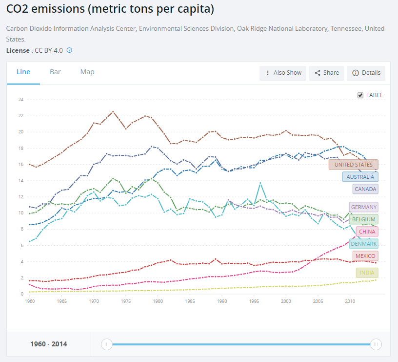

# 2019/W22: CO2 Emissions per capita

**Data (data.world):** [https://data.world/makeovermonday/2019w22](https://data.world/makeovermonday/2019w22)

**Article / original viz:** [https://data.worldbank.org/indicator/EN.ATM.CO2E.PC?end=2014&locations=AU-BE-CA-CN-DK-DE-IN-MX-US&start=1960&view=chart](https://data.worldbank.org/indicator/EN.ATM.CO2E.PC?end=2014&locations=AU-BE-CA-CN-DK-DE-IN-MX-US&start=1960&view=chart)

**Dataset:** `makeovermonday/2019w22`  
**Last updated on data.world:** 2019-05-26T09:58:12.262Z

---

CO2 Emissions per capita in metric tonnes

# **Original Visualization**

# **About this Dataset**
SOURCE ARTICLE: [CO2 Emissions per capita](https://data.worldbank.org/indicator/EN.ATM.CO2E.PC?end=2014&locations=AU-BE-CA-CN-DK-DE-IN-MX-US&start=1960&view=chart)
DATA SOURCE: [World Bank](http://api.worldbank.org/v2/en/indicator/EN.ATM.CO2E.PC?downloadformat=csv)

# **Objectives**

* What works and what doesn't work with this chart? 
* How can you make it better?