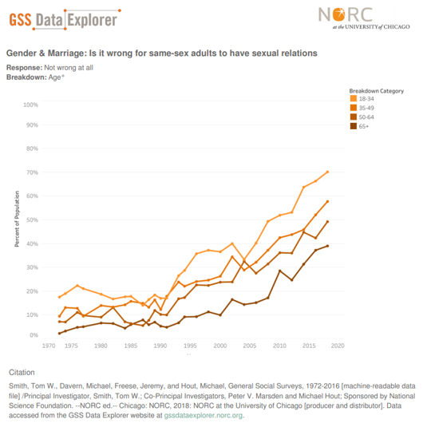

# 2019/W24: Same-sex couples and sexual relations

**Data (data.world):** [https://data.world/makeovermonday/2019w24](https://data.world/makeovermonday/2019w24)

**Article / original viz:** [https://gssdataexplorer.norc.org/trends/Gender%20&%20Marriage?measure=homosex](https://gssdataexplorer.norc.org/trends/Gender%20&%20Marriage?measure=homosex)

**Dataset:** `makeovermonday/2019w24`  
**Last updated on data.world:** 2019-06-09T10:02:20.476Z

---

Is it wrong for same-sex couples to have sexual relations?

---
{"editor":"markdown"}
---
# **Original Visualization**

# **About this Dataset**
SOURCE: [GSS Data Explorer](https://gssdataexplorer.norc.org/trends/Gender%20&%20Marriage?measure=homosex)

# **Objectives**

* What works and what doesn't work with this chart? 
* How can you make it better?