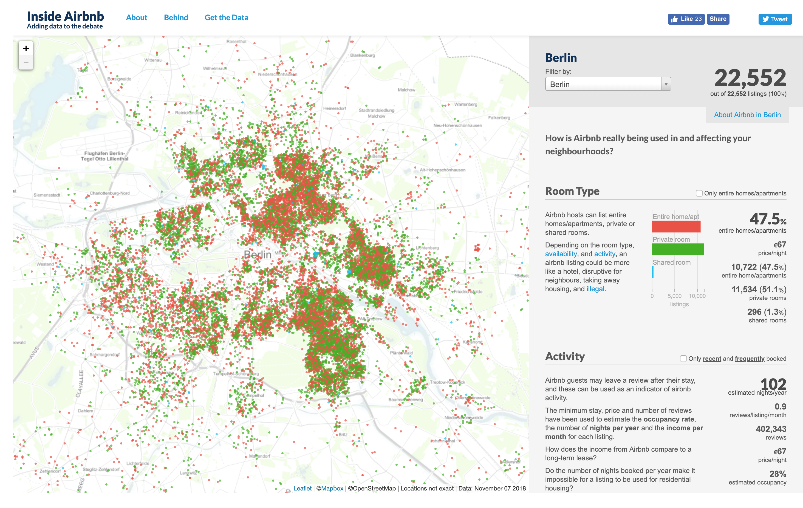

# 2019/W25: Berlin Airbnb Ratings

**Data (data.world):** [https://data.world/makeovermonday/2019w25](https://data.world/makeovermonday/2019w25)

**Article / original viz:** [http://insideairbnb.com/berlin/?neighbourhood=&filterEntireHomes=false&filterHighlyAvailable=false&filterRecentReviews=false&filterMultiListings=false](http://insideairbnb.com/berlin/?neighbourhood=&filterEntireHomes=false&filterHighlyAvailable=false&filterRecentReviews=false&filterMultiListings=false)

**Dataset:** `makeovermonday/2019w25`  
**Last updated on data.world:** 2019-06-17T11:49:40.465Z

---

Where can you find an Airbnb that meets you needs?

---
{"editor":"simple"}
---
# **Original Visualization**

​

# **About this Dataset**
ORIGINAL VISUALIZATION: [Inside Airbnb](http://insideairbnb.com/berlin/?neighbourhood=&filterEntireHomes=false&filterHighlyAvailable=false&filterRecentReviews=false&filterMultiListings=false)
DATA SOURCE: [Inside Airbnb](http://insideairbnb.com/get-the-data.html)

**NOTES:**

1. Data is available as CSV, Excel, or Tableau Hyper format.
2. A Geojson file of Berlin neighborhoods has also been included.
​
# **Objectives**

* What works and what doesn't work with this chart?
* How can you make it better?