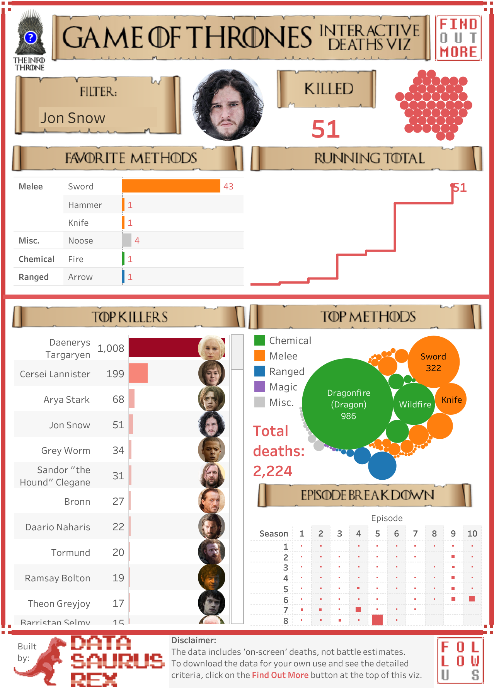

# 2019/W27: Deaths in Game of Thrones

**Data (data.world):** [https://data.world/makeovermonday/2019w27](https://data.world/makeovermonday/2019w27)

**Article / original viz:** [https://datasaurus-rex.com/gallery/gotviz-mkiii](https://datasaurus-rex.com/gallery/gotviz-mkiii)

**Original data source:** [https://data.world/datasaurusrex/game-of-thones-deaths](https://data.world/datasaurusrex/game-of-thones-deaths)

**Dataset:** `makeovermonday/2019w27`  
**Last updated on data.world:** 2019-06-30T13:16:31.901Z

---

Who killed who, with what, where and when in Game of Thrones?

---
{"editor":"simple"}
---
# **Original Visualization**

# **About this Dataset**
SOURCE ARTICLE: [David Murphy](https://datasaurus-rex.com/gallery/gotviz-mkiii)
DATA SOURCE: [data.world](https://data.world/datasaurusrex/game-of-thones-deaths)
DATA DICTIONARY: [data.world](https://data.world/datasaurusrex/game-of-thones-deaths/workspace/data-dictionary)

# **Objectives**

* What works and what doesn't work with this chart?
* How can you make it better?