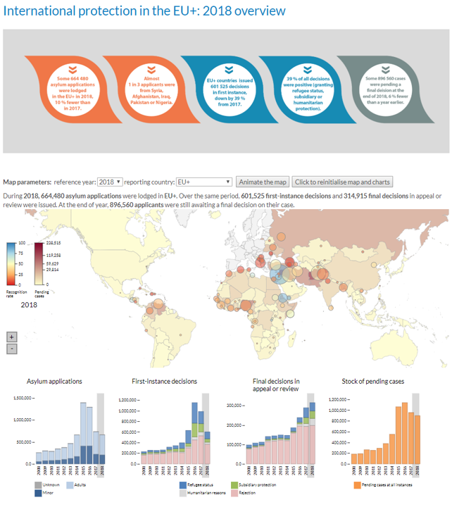

# 2019/W28: International protection in the EU+: 2018 overview

**Data (data.world):** [https://data.world/makeovermonday/2019w28](https://data.world/makeovermonday/2019w28)

**Article / original viz:** [https://www.easo.europa.eu/asylum-trends-annual-report-2018](https://www.easo.europa.eu/asylum-trends-annual-report-2018)

**Original data source:** [http://appsso.eurostat.ec.europa.eu/nui/show.do?dataset=migr_asyappctza&lang=en](http://appsso.eurostat.ec.europa.eu/nui/show.do?dataset=migr_asyappctza&lang=en)

**Dataset:** `makeovermonday/2019w28`  
**Last updated on data.world:** 2019-07-07T08:37:53.070Z

---

International protection in the EU+: 2018 overview

---
{"editor":"markdown"}
---
# **Original Visualization**

Please note: The data only covers the first two bar charts below the map. The rest of the dashboard has been included for context but data has not been provided.

# **About this Dataset**
SOURCE ARTICLE: [European Asylum Support Office](https://www.easo.europa.eu/asylum-trends-annual-report-2018)
DATA SOURCE: EUROSTAT, from 2009 to 2018 [Summary applications](http://appsso.eurostat.ec.europa.eu/nui/show.do?dataset=migr_asyappctza&lang=en)
[Decisions on applications](http://appsso.eurostat.ec.europa.eu/nui/show.do?dataset=migr_asydcfsta&lang=en)

# **Objectives**

* What works and what doesn't work with this chart? 
* How can you make it better?