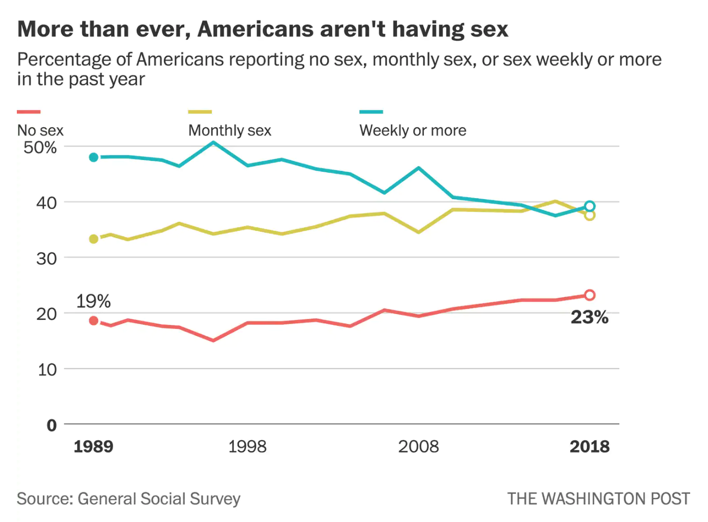

# 2019/W29: Share of Americans Not Having Sex

**Data (data.world):** [https://data.world/makeovermonday/2019w29](https://data.world/makeovermonday/2019w29)

**Article / original viz:** [https://www.washingtonpost.com/business/2019/03/29/share-americans-not-having-sex-has-reached-record-high](https://www.washingtonpost.com/business/2019/03/29/share-americans-not-having-sex-has-reached-record-high)

**Original data source:** [https://gssdataexplorer.norc.org/variables/5057/vshow](https://gssdataexplorer.norc.org/variables/5057/vshow)

**Dataset:** `makeovermonday/2019w29`  
**Last updated on data.world:** 2019-07-14T11:37:05.034Z

---

The share of Americans not having sex has reached a record high

---
{"editor":"simple"}
---
# **Original Visualization**

# **About this Dataset**
SOURCE ARTICLE: [The Washington Post](https://www.washingtonpost.com/business/2019/03/29/share-americans-not-having-sex-has-reached-record-high/)
DATA SOURCE: [General Social Survey](https://gssdataexplorer.norc.org/variables/5057/vshow)

# **Objectives**

* What works and what doesn't work with this chart?
* How can you make it better?