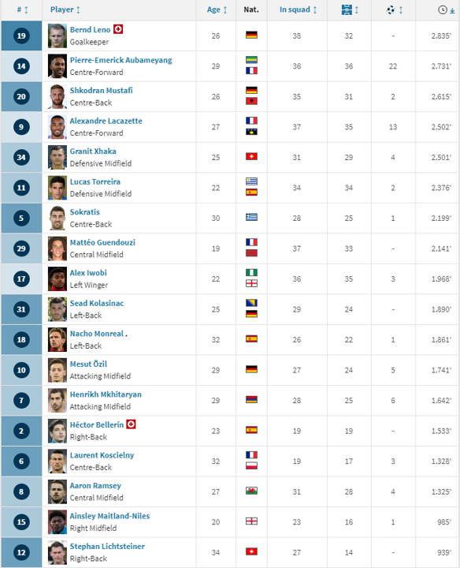

# 2019/W30: Arsenal FC's 2018/19 season

**Data (data.world):** [https://data.world/makeovermonday/2019w30](https://data.world/makeovermonday/2019w30)

**Article / original viz:** [https://www.transfermarkt.co.uk/arsenal-fc/leistungsdaten/verein/11/reldata/GB1%262018](https://www.transfermarkt.co.uk/arsenal-fc/leistungsdaten/verein/11/reldata/GB1%262018)

**Original data source:** [https://www.premierleague.com/stats/top/players/goals](https://www.premierleague.com/stats/top/players/goals)

**Dataset:** `makeovermonday/2019w30`  
**Last updated on data.world:** 2019-07-22T12:56:35.323Z

---

Player statistics for Arsenal's 2018/19 season

---
{"editor":"markdown"}
---
# **Original Visualization**

# **About this Dataset**
SOURCE ARTICLE: [Transfermarkt](https://www.transfermarkt.co.uk/arsenal-fc/leistungsdaten/verein/11/reldata/GB1%262018)
DATA SOURCE: [Premier League Stat Center](https://www.premierleague.com/stats/top/players/goals)

# **Objectives**

* What works and what doesn't work with this chart? 
* How can you make it better?