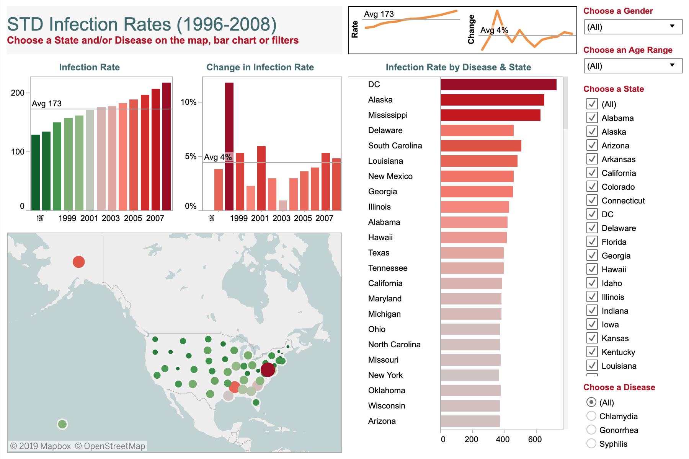

# 2019/W31: STD Infection Rates in America

**Data (data.world):** [https://data.world/makeovermonday/2019w31](https://data.world/makeovermonday/2019w31)

**Article / original viz:** [https://public.tableau.com/profile/andy.kriebel#!/vizhome/STDs1996-2008/STDInfectionRates](https://public.tableau.com/profile/andy.kriebel#!/vizhome/STDs1996-2008/STDInfectionRates)

**Original data source:** [https://wonder.cdc.gov/controller/datarequest/D128](https://wonder.cdc.gov/controller/datarequest/D128)

**Dataset:** `makeovermonday/2019w31`  
**Last updated on data.world:** 2019-07-28T12:39:31.997Z

---

How have rates changed by disease, year, state, gender, and age?

---
{"editor":"simple"}
---
# **Original Visualization**

​

### **About this Dataset**
ORIGINAL VIZ: [Tableau Public](https://public.tableau.com/profile/andy.kriebel#!/vizhome/STDs1996-2008/STDInfectionRates)
CREATED BY: [Andy Kriebel | @VizWizBI](https://twitter.com/VizWizBI)
DATA SOURCE: [CDC](https://wonder.cdc.gov/controller/datarequest/D128)

​

### **Objectives**

* What works and what doesn't work with this chart?
* How can you make it better?