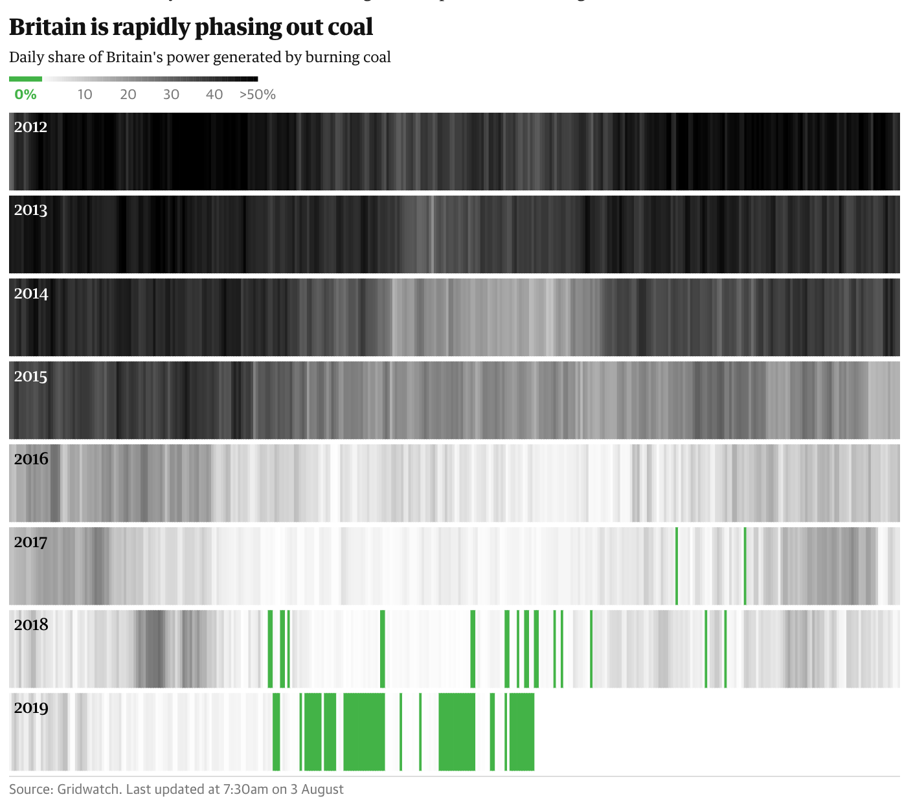

# 2019/W32: Britain is rapidly phasing out coal

**Data (data.world):** [https://data.world/makeovermonday/2019w32](https://data.world/makeovermonday/2019w32)

**Article / original viz:** [https://www.theguardian.com/environment/ng-interactive/2019/may/25/the-power-switch-tracking-britains-record-coal-free-run?utm_term=Autofeed&CMP=twt_gu&utm_medium=&utm_source=Twitter#Echobox=1558805012](https://www.theguardian.com/environment/ng-interactive/2019/may/25/the-power-switch-tracking-britains-record-coal-free-run?utm_term=Autofeed&CMP=twt_gu&utm_medium=&utm_source=Twitter#Echobox=1558805012)

**Original data source:** [https://www.gridwatch.templar.co.uk/download.php](https://www.gridwatch.templar.co.uk/download.php)

**Dataset:** `makeovermonday/2019w32`  
**Last updated on data.world:** 2019-08-04T04:24:34.186Z

---

Britain is rapidly phasing out coal

---
{"editor":"simple"}
---
# **Original Visualization**

# **About this Dataset**
SOURCE ARTICLE: [The Guardian](https://www.theguardian.com/environment/ng-interactive/2019/may/25/the-power-switch-tracking-britains-record-coal-free-run)
DATA SOURCE: [Gridwatch](https://www.gridwatch.templar.co.uk/download.php)

# **Objectives**

* What works and what doesn't work with this chart?
* How can you make it better?