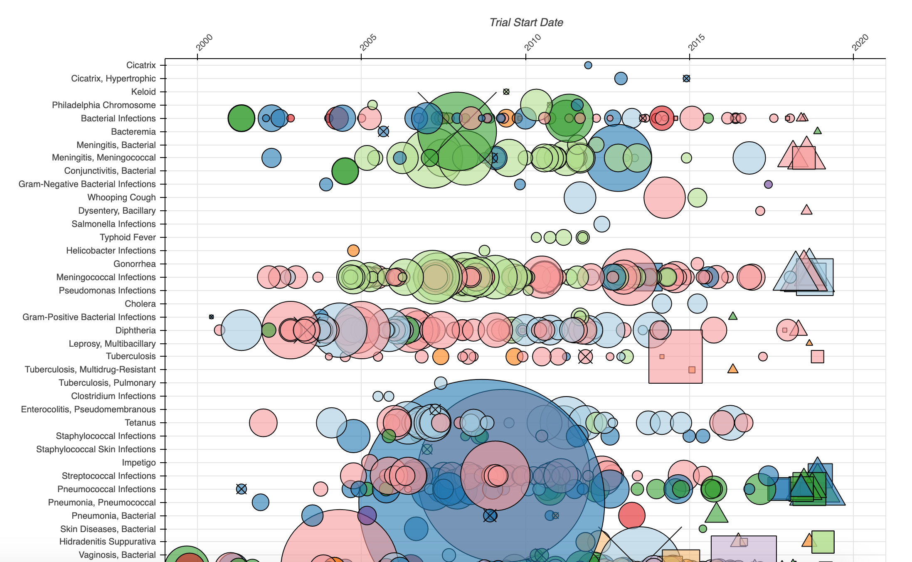

# 2019/W33: A bird’s-eye view of clinical trials

**Data (data.world):** [https://data.world/makeovermonday/2019w33](https://data.world/makeovermonday/2019w33)

**Article / original viz:** [https://www.statnews.com/2019/07/18/clinical-trials-birds-eye-view-drug-development/](https://www.statnews.com/2019/07/18/clinical-trials-birds-eye-view-drug-development/)

**Original data source:** [https://www.aerodatalab.org/birds-eye-view-of-research-landscape](https://www.aerodatalab.org/birds-eye-view-of-research-landscape)

**Dataset:** `makeovermonday/2019w33`  
**Last updated on data.world:** 2019-08-11T09:05:37.405Z

---

---
{"editor":"simple"}
---
# **Original Visualization**

# **About this Dataset**
SOURCE ARTICLE: [A bird’s-eye view of clinical trials](https://www.statnews.com/2019/07/18/clinical-trials-birds-eye-view-drug-development/)
DATA SOURCE/ORIGINAL VIZ: [Aero Data Lab](https://www.aerodatalab.org/birds-eye-view-of-research-landscape)

# **Objectives**

* What works and what doesn't work with this chart?
* How can you make it better?