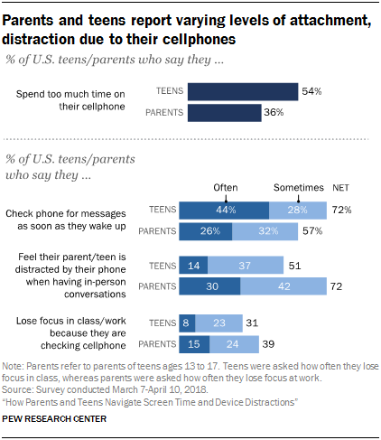

# 2019/W34:Americans touch their smartphones 2,617 times a day

**Data (data.world):** [https://data.world/makeovermonday/2019w34](https://data.world/makeovermonday/2019w34)

**Article / original viz:** [https://www.cnbc.com/2019/04/09/cal-newport-a-digital-declutter-can-help-you-reduce-smartphone-time.html](https://www.cnbc.com/2019/04/09/cal-newport-a-digital-declutter-can-help-you-reduce-smartphone-time.html)

**Original data source:** [https://www.pewinternet.org/2018/08/22/how-teens-and-parents-navigate-screen-time-and-device-distractions/pi_2018-08-22_teens-screentime_0-01/](https://www.pewinternet.org/2018/08/22/how-teens-and-parents-navigate-screen-time-and-device-distractions/pi_2018-08-22_teens-screentime_0-01/)

**Dataset:** `makeovermonday/2019w34`  
**Last updated on data.world:** 2019-08-18T19:19:20.831Z

---

Americans touch their smartphones 2,617 times a day

---
{"editor":"markdown"}
---
# **Original Visualization**

# **About this Dataset**
SOURCE ARTICLE: [CNBC](https://www.cnbc.com/2019/04/09/cal-newport-a-digital-declutter-can-help-you-reduce-smartphone-time.html)
DATA SOURCE: [Pew Research Center](hhttps://www.pewinternet.org/2018/08/22/how-teens-and-parents-navigate-screen-time-and-device-distractions/pi_2018-08-22_teens-screentime_0-01/)

# **Objectives**

* What works and what doesn't work with this chart? 
* How can you make it better?