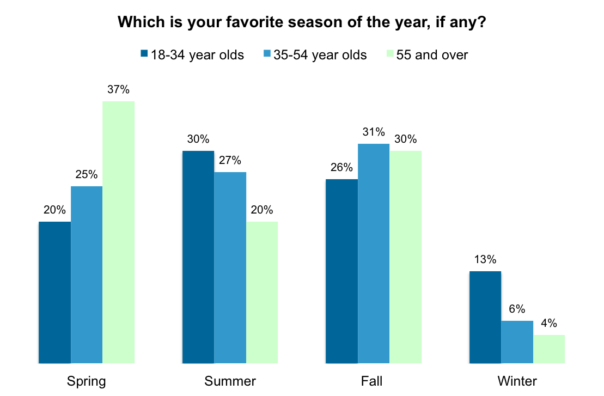

# 2019/W36: Fall is favorite season for most Americans

**Data (data.world):** [https://data.world/makeovermonday/2019w36](https://data.world/makeovermonday/2019w36)

**Article / original viz:** [https://today.yougov.com/topics/lifestyle/articles-reports/2013/06/10/fall-favorite-season-most-americans-33-heartland-l](https://today.yougov.com/topics/lifestyle/articles-reports/2013/06/10/fall-favorite-season-most-americans-33-heartland-l)

**Original data source:** [https://today.yougov.com/topics/lifestyle/articles-reports/2013/06/10/fall-favorite-season-most-americans-33-heartland-l](https://today.yougov.com/topics/lifestyle/articles-reports/2013/06/10/fall-favorite-season-most-americans-33-heartland-l)

**Dataset:** `makeovermonday/2019w36`  
**Last updated on data.world:** 2019-09-01T09:27:29.356Z

---

Fall is favorite season for most Americans

---
{"editor":"markdown"}
---
# **Original Visualization**

# **About this Dataset**
SOURCE ARTICLE: [YouGov](https://today.yougov.com/topics/lifestyle/articles-reports/2013/06/10/fall-favorite-season-most-americans-33-heartland-l)
DATA SOURCE: [YouGov](https://today.yougov.com/topics/lifestyle/articles-reports/2013/06/10/fall-favorite-season-most-americans-33-heartland-l)

# **Objectives**

* What works and what doesn't work with this chart? 
* How can you make it better?