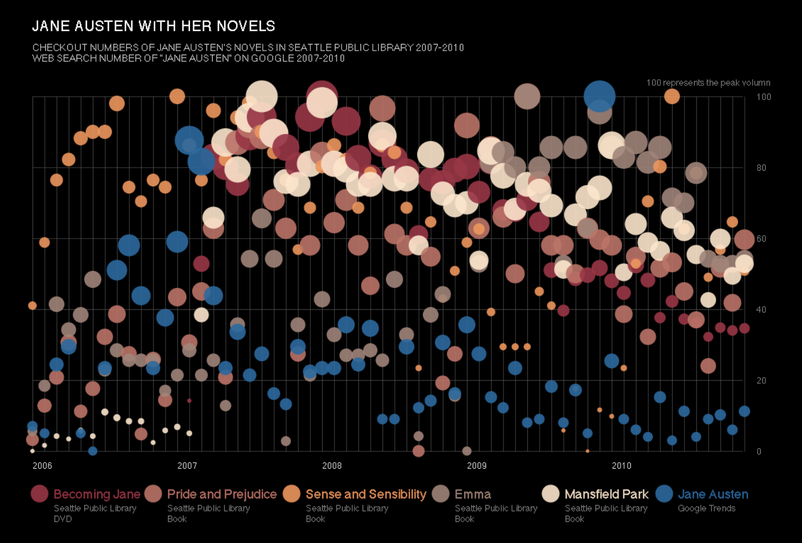

# 2019/W37: James Patterson Book Checkouts in Seattle

**Data (data.world):** [https://data.world/makeovermonday/2019w37](https://data.world/makeovermonday/2019w37)

**Article / original viz:** [http://helper.ipam.ucla.edu/publications/caws1/caws1_13603.pdf](http://helper.ipam.ucla.edu/publications/caws1/caws1_13603.pdf)

**Original data source:** [https://data.seattle.gov/Community/Checkouts-by-Title/tmmm-ytt6/data](https://data.seattle.gov/Community/Checkouts-by-Title/tmmm-ytt6/data)

**Dataset:** `makeovermonday/2019w37`  
**Last updated on data.world:** 2019-09-08T18:41:29.771Z

---

Seattle Public Library monthly checkouts of books written by James Patterson

---
{"editor":"simple"}
---
# **Original Visualization**

​

# **About this Dataset**
SOURCE ARTICLE: [Making Visible the Invisible: DataVis at the Seattle Public Library](http://helper.ipam.ucla.edu/publications/caws1/caws1_13603.pdf)
DATA SOURCE: [Seattle Open Data](https://data.seattle.gov/Community/Checkouts-by-Title/tmmm-ytt6/data)

# **Objectives**

* What works and what doesn't work with this chart?
* How can you make it better?