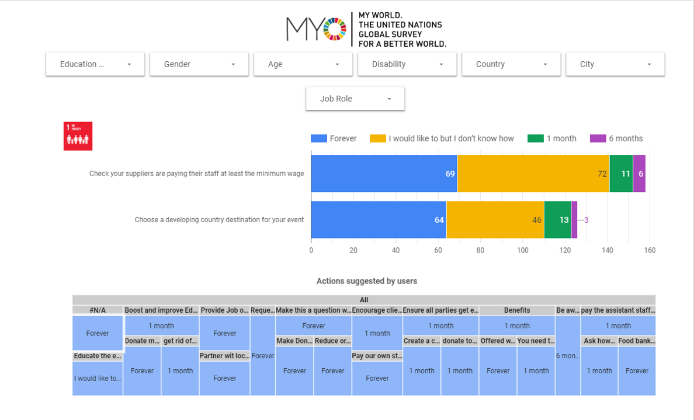

# 2019/W38: Positive Impact Events - SDG Commitments

**Data (data.world):** [https://data.world/makeovermonday/2019w38](https://data.world/makeovermonday/2019w38)

**Article / original viz:** [https://datastudio.google.com/u/0/reporting/1VZc12vP-qsKGvdghQdvCm3zb6pKe3Ztc/page/66Sr](https://datastudio.google.com/u/0/reporting/1VZc12vP-qsKGvdghQdvCm3zb6pKe3Ztc/page/66Sr)

**Original data source:** [https://events.myworld2030.org/](https://events.myworld2030.org/)

**Dataset:** `makeovermonday/2019w38`  
**Last updated on data.world:** 2019-09-15T18:28:55.374Z

---

Positive Impact Events - Commitments from the Event Industry for the Sustainable Development Goals

---
{"editor":"markdown"}
---
# **Original Visualization**

# **About this Dataset**
SOURCE ARTICLE: [Positive Impact Events - Committments from the Event Industry for the Sustainable Development Goals](https://datastudio.google.com/u/0/reporting/1VZc12vP-qsKGvdghQdvCm3zb6pKe3Ztc/page/66Sr)
DATA SOURCE: [MyWorld2030 Events Survey](https://events.myworld2030.org/)
ADDITIONAL INFORMATION: [Positive Impact Events Website](https://www.positiveimpactevents.com)
TWITTER: Please tag [sdgaction](https://twitter.com/SDGaction) on Twitter and use the hashtag #Act4SDGs

# **Objectives**

* What works and what doesn't work with this chart? 
* How can you make it better?