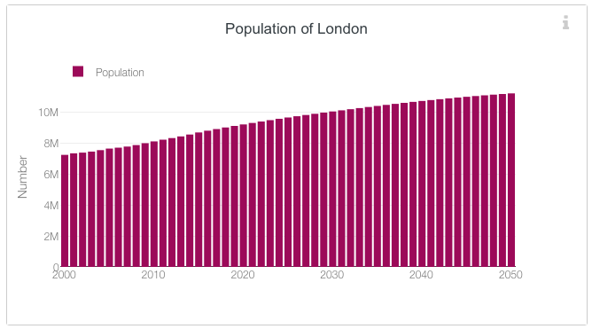

# 2019/W40: London Population Predictions

**Data (data.world):** [https://data.world/makeovermonday/2019w40](https://data.world/makeovermonday/2019w40)

**Article / original viz:** [https://data.london.gov.uk/](https://data.london.gov.uk/)

**Original data source:** [https://data.london.gov.uk/download/projections/fcda413b-2b3a-44cd-a692-242bc45ffe24/central_trend_2017_base.xlsx](https://data.london.gov.uk/download/projections/fcda413b-2b3a-44cd-a692-242bc45ffe24/central_trend_2017_base.xlsx)

**Dataset:** `makeovermonday/2019w40`  
**Last updated on data.world:** 2023-04-11T12:35:38.242857966Z

---

London Population Predictions

---
{"editor":"markdown"}
---
# **Original Visualization**

# **About this Dataset**
SOURCE ARTICLE: [The Population of London (click on 'Communities')](https://data.london.gov.uk)
DATA SOURCE: [London Datastore](https://data.london.gov.uk/download/projections/fcda413b-2b3a-44cd-a692-242bc45ffe24/central_trend_2017_base.xlsx)

# **Objectives**

* What works and what doesn't work with this chart? 
* How can you make it better?