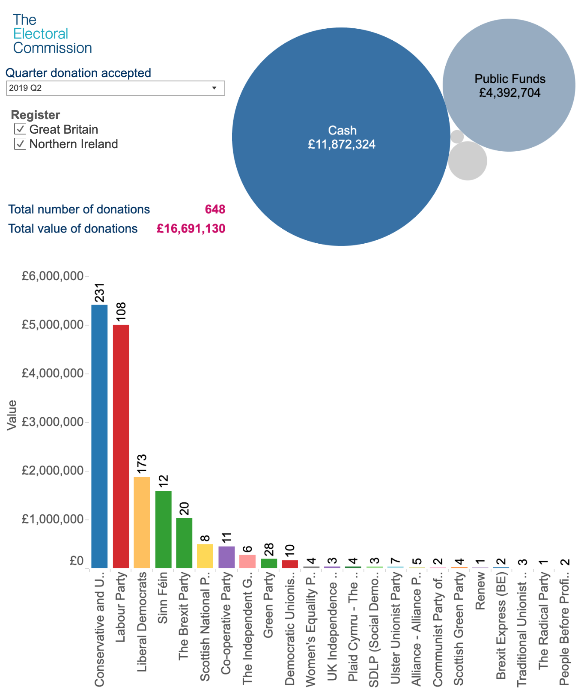

# 2019/W41: Donations Accepted By Political Parties in the UK

**Data (data.world):** [https://data.world/makeovermonday/2019w41](https://data.world/makeovermonday/2019w41)

**Article / original viz:** [https://www.electoralcommission.org.uk/who-we-are-and-what-we-do/financial-reporting/donations-and-loans/view-donations-and-loans/donations-accepted](https://www.electoralcommission.org.uk/who-we-are-and-what-we-do/financial-reporting/donations-and-loans/view-donations-and-loans/donations-accepted)

**Original data source:** [http://search.electoralcommission.org.uk/?currentPage=1&rows=10&sort=AcceptedDate&order=desc&tab=1&et=pp&et=ppm&et=tp&et=perpar&et=rd&isIrishSourceYes=true&isIrishSourceNo=true&prePoll=false&postPoll=true&register=gb&register=ni&register=none&optCols=Register&optCols=CampaigningName&optCols=AccountingUnitsAsCentralParty&optCols=IsSponsorship&optCols=IsIrishSource&optCols=RegulatedDoneeType&optCols=CompanyRegistrationNumber&optCols=Postcode&optCols=NatureOfDonation&optCols=PurposeOfVisit&optCols=DonationAction&optCols=ReportedDate&optCols=IsReportedPrePoll&optCols=ReportingPeriodName&optCols=IsBequest&optCols=IsAggregation](http://search.electoralcommission.org.uk/?currentPage=1&rows=10&sort=AcceptedDate&order=desc&tab=1&et=pp&et=ppm&et=tp&et=perpar&et=rd&isIrishSourceYes=true&isIrishSourceNo=true&prePoll=false&postPoll=true&register=gb&register=ni&register=none&optCols=Register&optCols=CampaigningName&optCols=AccountingUnitsAsCentralParty&optCols=IsSponsorship&optCols=IsIrishSource&optCols=RegulatedDoneeType&optCols=CompanyRegistrationNumber&optCols=Postcode&optCols=NatureOfDonation&optCols=PurposeOfVisit&optCols=DonationAction&optCols=ReportedDate&optCols=IsReportedPrePoll&optCols=ReportingPeriodName&optCols=IsBequest&optCols=IsAggregation)

**Dataset:** `makeovermonday/2019w41`  
**Last updated on data.world:** 2019-10-06T11:31:28.285Z

---

Donations Accepted By Political Parties in Great Britain and Northern Ireland

---
{"editor":"simple"}
---
# **Original Visualization**

​

# **About this Dataset**
SOURCE: [The Electoral Commission](https://www.electoralcommission.org.uk/who-we-are-and-what-we-do/financial-reporting/donations-and-loans/view-donations-and-loans/donations-accepted)
DATA SOURCE: [The Electoral Commission](http://search.electoralcommission.org.uk/?currentPage=1&rows=10&sort=AcceptedDate&order=desc&tab=1&et=pp&et=ppm&et=tp&et=perpar&et=rd&isIrishSourceYes=true&isIrishSourceNo=true&prePoll=false&postPoll=true&register=gb&register=ni&register=none&optCols=Register&optCols=CampaigningName&optCols=AccountingUnitsAsCentralParty&optCols=IsSponsorship&optCols=IsIrishSource&optCols=RegulatedDoneeType&optCols=CompanyRegistrationNumber&optCols=Postcode&optCols=NatureOfDonation&optCols=PurposeOfVisit&optCols=DonationAction&optCols=ReportedDate&optCols=IsReportedPrePoll&optCols=ReportingPeriodName&optCols=IsBequest&optCols=IsAggregation)

# **Objectives**

* What works and what doesn't work with this chart?
* How can you make it better?