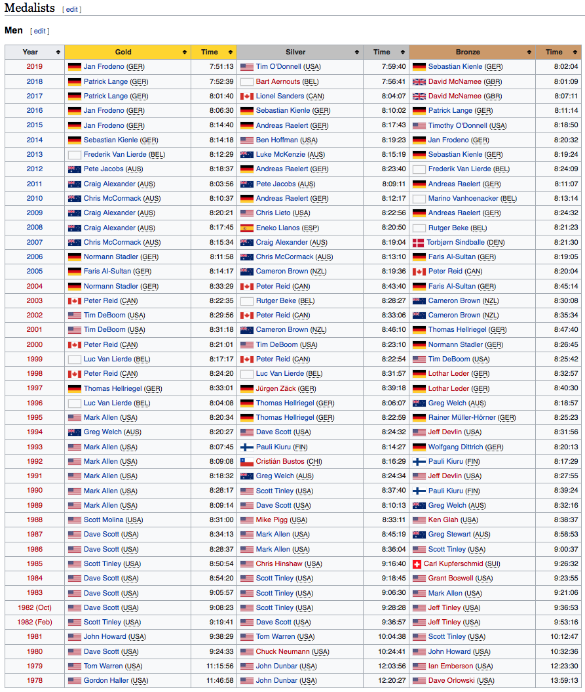

# 2019/W42: Ironman World Championship Medalists

**Data (data.world):** [https://data.world/makeovermonday/2019w42](https://data.world/makeovermonday/2019w42)

**Article / original viz:** [https://en.wikipedia.org/wiki/Ironman_World_Championship](https://en.wikipedia.org/wiki/Ironman_World_Championship)

**Original data source:** [https://en.wikipedia.org/wiki/Ironman_World_Championship](https://en.wikipedia.org/wiki/Ironman_World_Championship)

**Dataset:** `makeovermonday/2019w42`  
**Last updated on data.world:** 2019-10-13T09:27:44.497Z

---

Ironman World Championship Medalists

---
{"editor":"markdown"}
---
# **Original Visualization**

# **About this Dataset**
SOURCE ARTICLE: [Wikipedia](https://en.wikipedia.org/wiki/Ironman_World_Championship)
DATA SOURCE: [Wikipedia](https://en.wikipedia.org/wiki/Ironman_World_Championship)

# **Objectives**

* What works and what doesn't work with this chart? 
* How can you make it better?