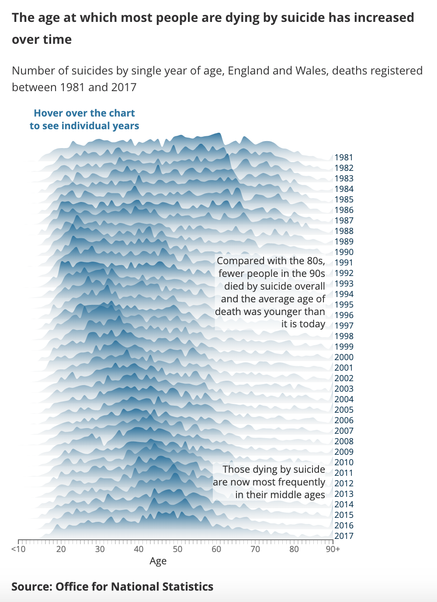

# 2019/W43: The Age At Which Most People Are Dying By Suicide

**Data (data.world):** [https://data.world/makeovermonday/2019w43](https://data.world/makeovermonday/2019w43)

**Article / original viz:** [https://www.ons.gov.uk/peoplepopulationandcommunity/healthandsocialcare/healthandwellbeing/articles/middleagedgenerationmostlikelytodiebysuicideanddrugpoisoning/2019-08-13](https://www.ons.gov.uk/peoplepopulationandcommunity/healthandsocialcare/healthandwellbeing/articles/middleagedgenerationmostlikelytodiebysuicideanddrugpoisoning/2019-08-13)

**Dataset:** `makeovermonday/2019w43`  
**Last updated on data.world:** 2019-10-25T09:38:23.155Z

---

CONTENT WARNING: Suicide - Number of people dying by suicide by single year of age in England and Wales

---
{"editor":"markdown"}
---
# **Original Visualization**

# **About this Dataset**
SOURCE: [Office for National Statistics](https://www.ons.gov.uk/peoplepopulationandcommunity/healthandsocialcare/healthandwellbeing/articles/middleagedgenerationmostlikelytodiebysuicideanddrugpoisoning/2019-08-13)

# **Objectives**

* What works and what doesn't work with this chart?
* How can you make it better?