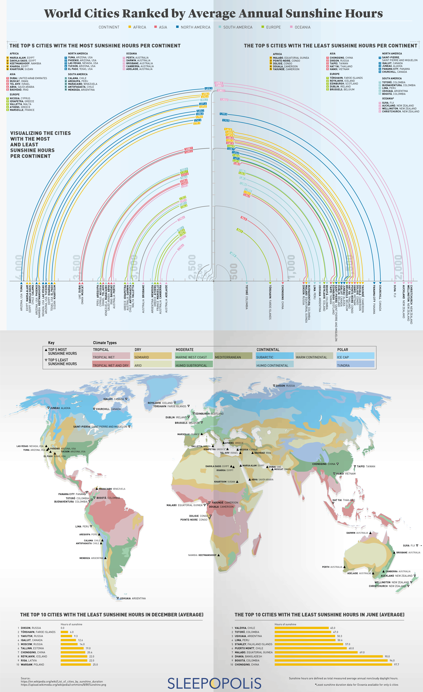

# 2019/W44: World Cities Ranked by Annual Sunshine Hours

**Data (data.world):** [https://data.world/makeovermonday/2019w44](https://data.world/makeovermonday/2019w44)

**Article / original viz:** [https://www.visualcapitalist.com/wp-content/uploads/2019/10/world-cities-by-hours-annual-sunshine.html](https://www.visualcapitalist.com/wp-content/uploads/2019/10/world-cities-by-hours-annual-sunshine.html)

**Original data source:** [https://en.m.wikipedia.org/wiki/List_of_cities_by_sunshine_duration](https://en.m.wikipedia.org/wiki/List_of_cities_by_sunshine_duration)

**Dataset:** `makeovermonday/2019w44`  
**Last updated on data.world:** 2019-10-27T17:13:52.013Z

---

World Cities Ranked by Annual Average Sunshine Hours

---
{"editor":"markdown"}
---
# **Original Visualization**

# **About this Dataset**
SOURCE ARTICLE: [World Cities Ranked by Average Annual Sunshine Hours](https://www.visualcapitalist.com/wp-content/uploads/2019/10/world-cities-by-hours-annual-sunshine.html)
DATA SOURCE: [Wikipedia](https://en.m.wikipedia.org/wiki/List_of_cities_by_sunshine_duration)

# **Objectives**

* What works and what doesn't work with this chart? 
* How can you make it better?