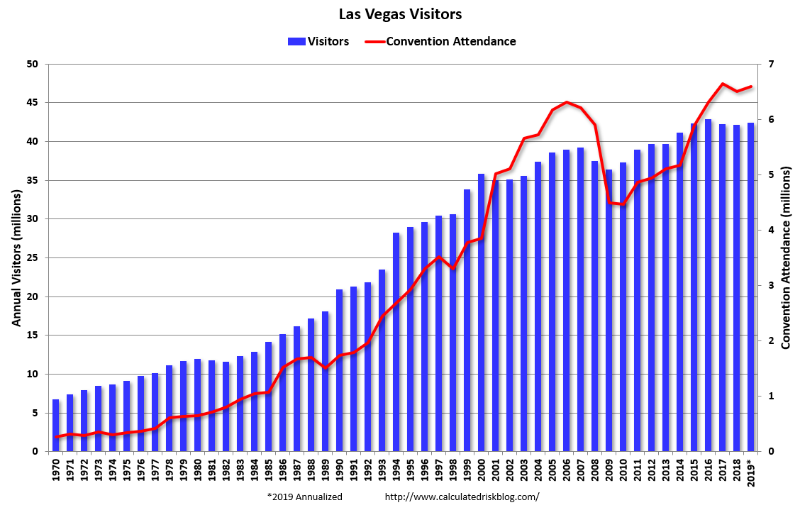

# 2019/W45: Las Vegas Convention Attendance & Visitor Traffic

**Data (data.world):** [https://data.world/makeovermonday/2019w45](https://data.world/makeovermonday/2019w45)

**Article / original viz:** [https://www.calculatedriskblog.com/2019/05/las-vegas-convention-attendance-and.html](https://www.calculatedriskblog.com/2019/05/las-vegas-convention-attendance-and.html)

**Original data source:** [https://www.lvcva.com/stats-and-facts/visitor-statistics/](https://www.lvcva.com/stats-and-facts/visitor-statistics/)

**Dataset:** `makeovermonday/2019w45`  
**Last updated on data.world:** 2019-11-03T11:08:29.281Z

---

Las Vegas Convention Attendance & Visitor Traffic: Jan 1970- Oct 2019

---
{"editor":"simple"}
---
# **Original Visualization**

# **About this Dataset**
SOURCE ARTICLE: [Calculated Risk Blog](https://www.calculatedriskblog.com/2019/05/las-vegas-convention-attendance-and.html)
DATA SOURCE: [Las Vegas Convention and Visitors Authority](https://www.lvcva.com/stats-and-facts/visitor-statistics/)

# **Objectives**

* What works and what doesn't work with this chart?
* How can you make it better?