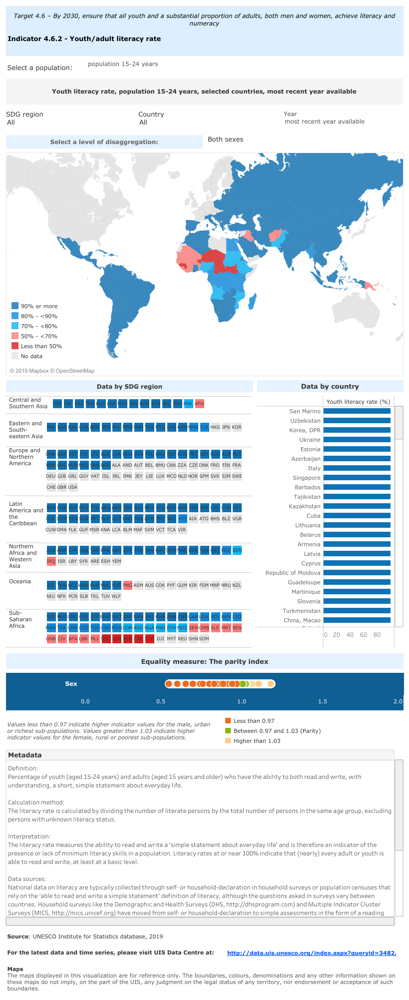

# 2019/W46: Youth & adult literacy rates

**Data (data.world):** [https://data.world/makeovermonday/2019w46](https://data.world/makeovermonday/2019w46)

**Article / original viz:** [http://tcg.uis.unesco.org/4-6-2-youth-adult-literacy-rate/](http://tcg.uis.unesco.org/4-6-2-youth-adult-literacy-rate/)

**Original data source:** [http://data.uis.unesco.org/index.aspx?queryid=3482](http://data.uis.unesco.org/index.aspx?queryid=3482)

**Dataset:** `makeovermonday/2019w46`  
**Last updated on data.world:** 2019-11-12T21:30:59.892Z

---

Youth & adult literacy rates

---
{"editor":"markdown"}
---
# **Original Visualization**

# **About this Dataset**
SOURCE ARTICLE: [UNESCO](http://tcg.uis.unesco.org/4-6-2-youth-adult-literacy-rate/)
DATA SOURCE: [UNESCO SDG4](http://data.uis.unesco.org/index.aspx?queryid=3482)

# **Objectives**

* What works and what doesn't work with this chart? 
* How can you make it better?