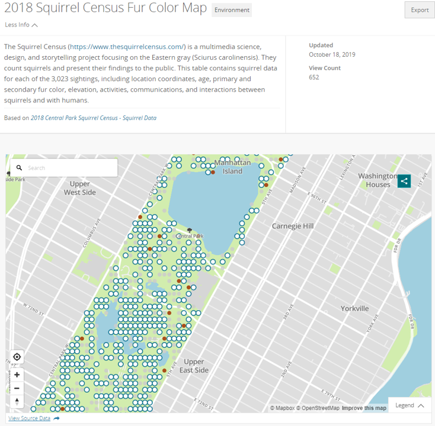

# 2019/W48: 2018 Squirrel Census Fur Color Map

**Data (data.world):** [https://data.world/makeovermonday/2019w48](https://data.world/makeovermonday/2019w48)

**Article / original viz:** [https://data.cityofnewyork.us/Environment/2018-Squirrel-Census-Fur-Color-Map/fak5-wcft](https://data.cityofnewyork.us/Environment/2018-Squirrel-Census-Fur-Color-Map/fak5-wcft)

**Original data source:** [https://data.cityofnewyork.us/Environment/2018-Central-Park-Squirrel-Census-Squirrel-Data/vfnx-vebw](https://data.cityofnewyork.us/Environment/2018-Central-Park-Squirrel-Census-Squirrel-Data/vfnx-vebw)

**Dataset:** `makeovermonday/2019w48`  
**Last updated on data.world:** 2019-11-24T11:56:07.390Z

---

2018 Squirrel Census Fur Color Map

---
{"editor":"markdown"}
---
# **Original Visualization**

# **About this Dataset**
SOURCE ARTICLE: [2018 Squirrel Census Fur Map](https://data.cityofnewyork.us/Environment/2018-Squirrel-Census-Fur-Color-Map/fak5-wcft)
DATA SOURCE: [NYC Open Data](https://data.cityofnewyork.us/Environment/2018-Central-Park-Squirrel-Census-Squirrel-Data/vfnx-vebw)

# **Objectives**

* What works and what doesn't work with this chart? 
* How can you make it better?