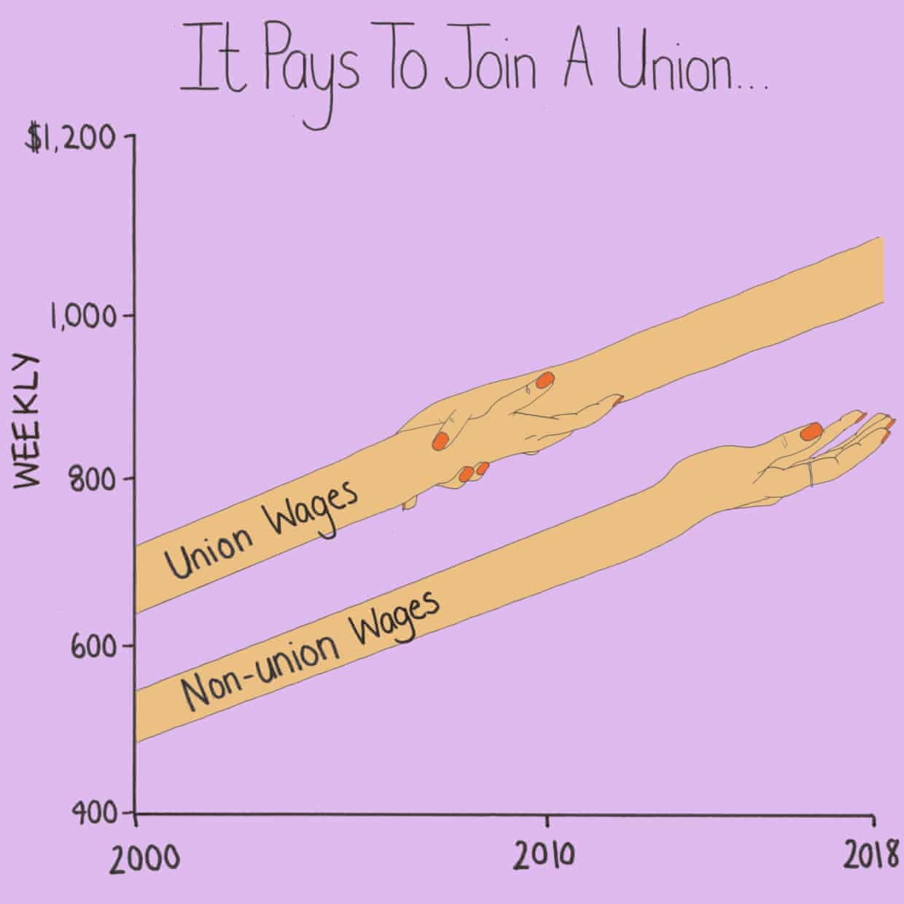
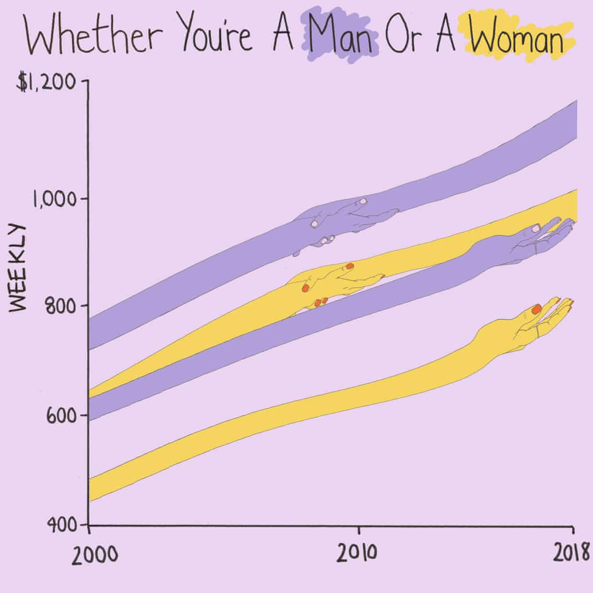
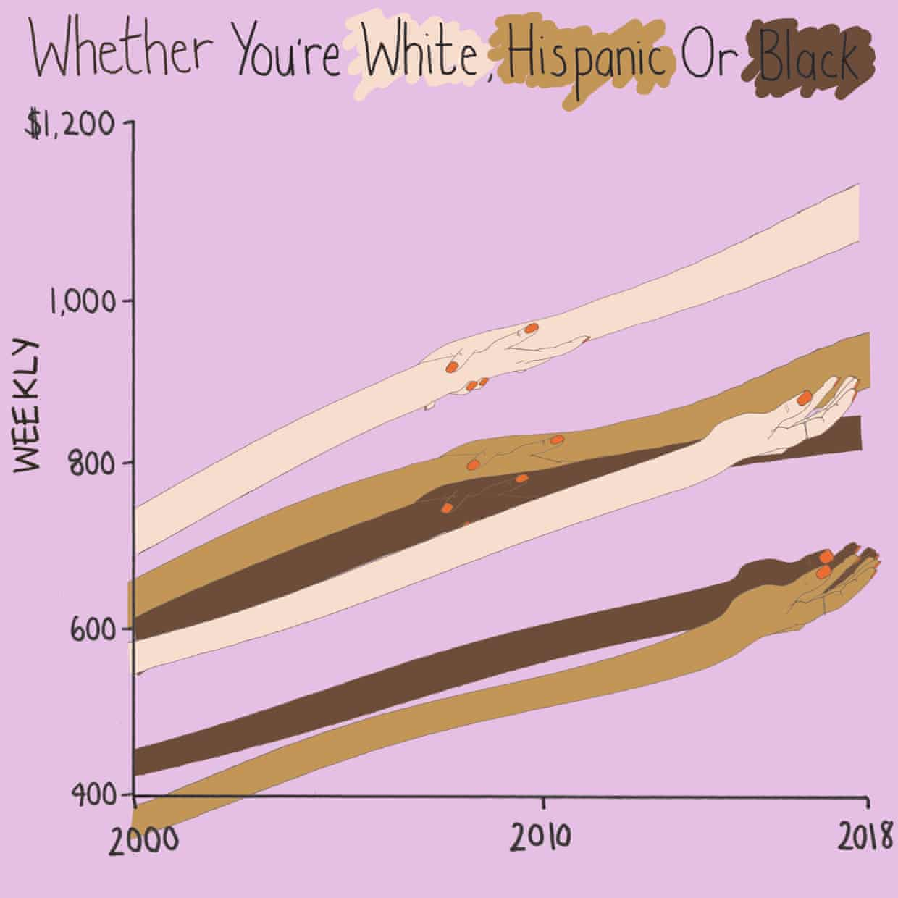

# 2019/W49: How much do unions benefit America's workers?

**Data (data.world):** [https://data.world/makeovermonday/2019w49](https://data.world/makeovermonday/2019w49)

**Article / original viz:** [https://www.theguardian.com/news/datablog/2019/nov/24/how-much-does-union-membership-benefit-americas-workers](https://www.theguardian.com/news/datablog/2019/nov/24/how-much-does-union-membership-benefit-americas-workers)

**Original data source:** [https://www.bls.gov/webapps/legacy/cpslutab2.htm](https://www.bls.gov/webapps/legacy/cpslutab2.htm)

**Dataset:** `makeovermonday/2019w49`  
**Last updated on data.world:** 2019-12-01T10:41:53.973Z

---

How much does union membership benefit America's workers?

---
{"editor":"markdown"}
---
# **Original Visualization**

# **About this Dataset**
SOURCE ARTICLE: [The Guardian](https://www.theguardian.com/news/datablog/2019/nov/24/how-much-does-union-membership-benefit-americas-workers)
DATA SOURCE: [Bureau of Labor Statistics](https://www.bls.gov/webapps/legacy/cpslutab2.htm)

# **Objectives**
* What works and what doesn't work with this chart? 
* How can you make it better?