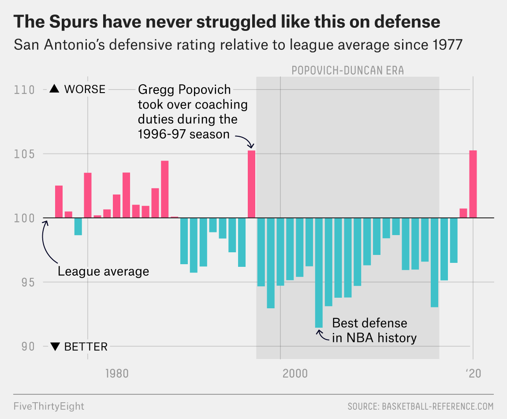

# 2019/W51: NBA Defensive Ratings

**Data (data.world):** [https://data.world/makeovermonday/2019w51](https://data.world/makeovermonday/2019w51)

**Article / original viz:** [https://fivethirtyeight.com/features/the-spurs-have-never-been-this-bad-at-defense/](https://fivethirtyeight.com/features/the-spurs-have-never-been-this-bad-at-defense/)

**Dataset:** `makeovermonday/2019w51`  
**Last updated on data.world:** 2019-12-15T10:43:24.409Z

---

The Spurs have never been this bad at defense. Which NBA teams are the best defensively?

---
{"editor":"simple"}
---
# **Original Visualization**

# **About this Dataset**
SOURCE ARTICLE: [FiveThirtyEight](https://fivethirtyeight.com/features/the-spurs-have-never-been-this-bad-at-defense/)
DATA SOURCE: [NBA](https://stats.nba.com/teams/defense/?sort=DEF_RATING&dir=-1&Season=2019-20&SeasonType=Regular%20Season)

# **Objectives**
* What works and what doesn't work with this chart? 
* How can you make it better?