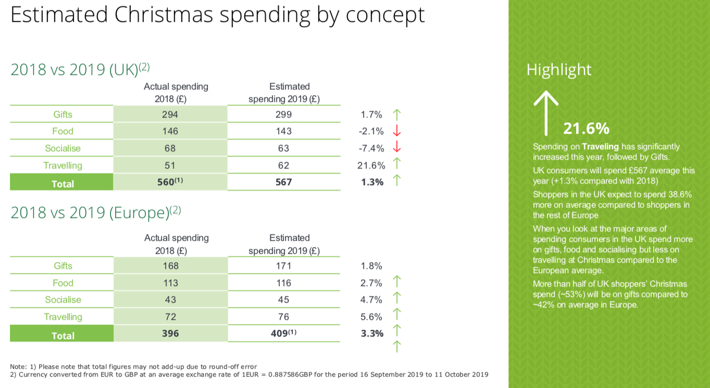

# 2019/W52: Estimated Christmas spending by concept

**Data (data.world):** [https://data.world/makeovermonday/2019w52](https://data.world/makeovermonday/2019w52)

**Article / original viz:** [https://www2.deloitte.com/content/dam/Deloitte/uk/Documents/consumer-business/deloitte-uk-christmas-survey-2019.pdf](https://www2.deloitte.com/content/dam/Deloitte/uk/Documents/consumer-business/deloitte-uk-christmas-survey-2019.pdf)

**Dataset:** `makeovermonday/2019w52`  
**Last updated on data.world:** 2019-12-22T11:24:02.744Z

---

Estimated Christmas spending by concept

---
{"editor":"markdown"}
---
# **Original Visualization**

# **About this Dataset**
SOURCE ARTICLE: [Deloitte UK Christmas Survey 2019](https://www2.deloitte.com/uk/en/pages/consumer-business/articles/deloitte-christmas-survey-2019.html)
DATA SOURCE: [Deloitte UK Christmas Survey 2019](https://www2.deloitte.com/content/dam/Deloitte/uk/Documents/consumer-business/deloitte-uk-christmas-survey-2019.pdf)

# **Objectives**

* What works and what doesn't work with this chart? 
* How can you make it better?