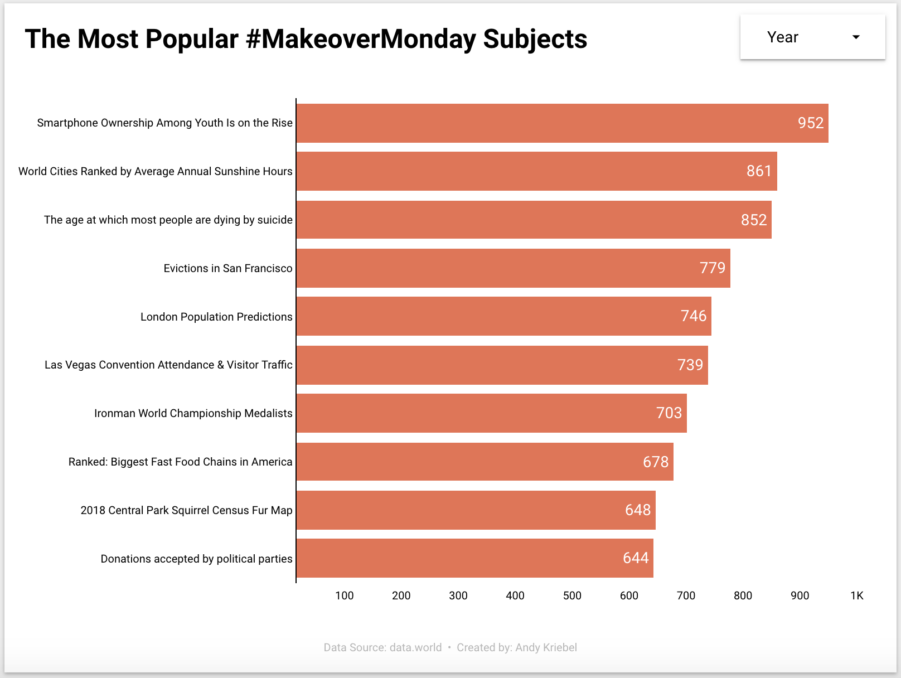

# 2019/W53: The Most Popular Makeover Monday Topics

**Data (data.world):** [https://data.world/makeovermonday/2019w53](https://data.world/makeovermonday/2019w53)

**Article / original viz:** [https://datastudio.google.com/reporting/e801e09d-b45c-4642-ba94-c887e69f781d](https://datastudio.google.com/reporting/e801e09d-b45c-4642-ba94-c887e69f781d)

**Dataset:** `makeovermonday/2019w53`  
**Last updated on data.world:** 2019-12-29T14:35:59.546Z

---

Top 10 most downloaded topics

---
{"editor":"simple"}
---
# **Original Visualization**

​

# **About this Dataset**
SOURCE: [Data Studio](https://datastudio.google.com/reporting/e801e09d-b45c-4642-ba94-c887e69f781d)

DATA SOURCES: data.world • Makeover Monday

​

# **Objectives**

* What works and what doesn't work with this chart?
* How can you make it better?