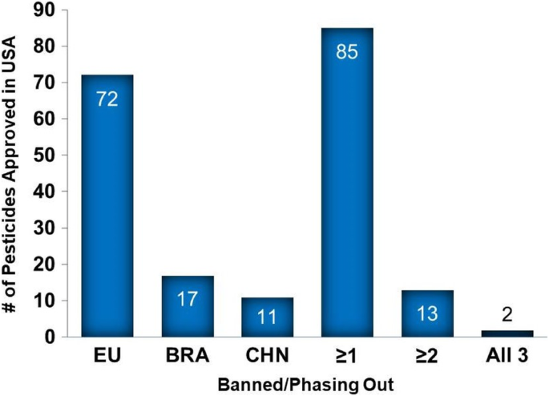

# 2020/W2: Use of harmful pesticides in US agriculture

**Data (data.world):** [https://data.world/makeovermonday/2020w2](https://data.world/makeovermonday/2020w2)

**Article / original viz:** [https://ehjournal.biomedcentral.com/articles/10.1186/s12940-019-0488-0/figures/1](https://ehjournal.biomedcentral.com/articles/10.1186/s12940-019-0488-0/figures/1)

**Dataset:** `makeovermonday/2020w2`  
**Last updated on data.world:** 2020-01-12T10:16:05.377Z

---

Use of harmful pesticides in US agriculture

---
{"editor":"markdown"}
---
# **Original Visualization**

# **About this Dataset**
SOURCE ARTICLE: [The USA lags behind other agricultural nations in banning harmful pesticides](https://ehjournal.biomedcentral.com/articles/10.1186/s12940-019-0488-0)
DATA SOURCE: [Total Agricultural Pesticides Used in the USA and Banned in the EU, Brazil or China](https://ehjournal.biomedcentral.com/articles/10.1186/s12940-019-0488-0/tables/1)

# **Objectives**

* What works and what doesn't work with this chart? 
* How can you make it better?