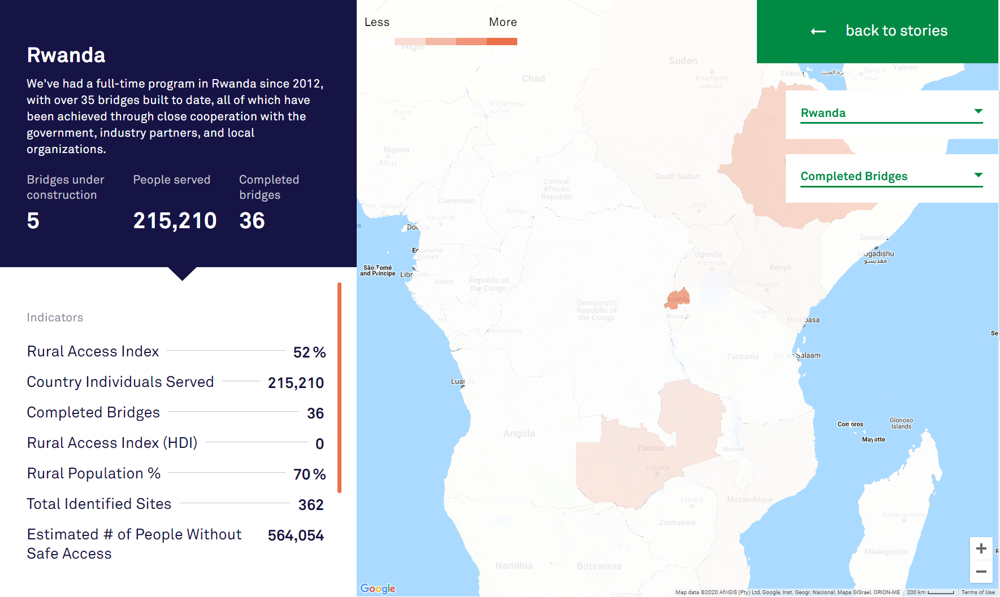

# 2020/W4: Bridges for Prosperity - Rwanda

**Data (data.world):** [https://data.world/makeovermonday/2020w4](https://data.world/makeovermonday/2020w4)

**Article / original viz:** [https://bridgestoprosperity.org/global-work/zambia](https://bridgestoprosperity.org/global-work/zambia)

**Dataset:** `makeovermonday/2020w4`  
**Last updated on data.world:** 2020-01-26T15:50:18.646Z

---

Bridges for Prosperity - Rwanda

---
{"editor":"markdown"}
---
# **Original Visualization**

​

# **About this Dataset**
SOURCE ARTICLE: [Bridges for Prosperity - Global Work](https://bridgestoprosperity.org/global-work/rwanda)
DATA SOURCE: [Bridges for Prosperity - Global Indicators](https://bridges.app.box.com/s/7kloiebfxlni6ruhmv3wqyw8zclgep81) | [Bridges for Prosperity - Bridges](https://bridges.app.box.com/s/pdvbowjrsakl6t2mmx0zpnzm1f1tzzu2)

# **Objectives**

* What works and what doesn't work with this chart?
* How can you make it better?