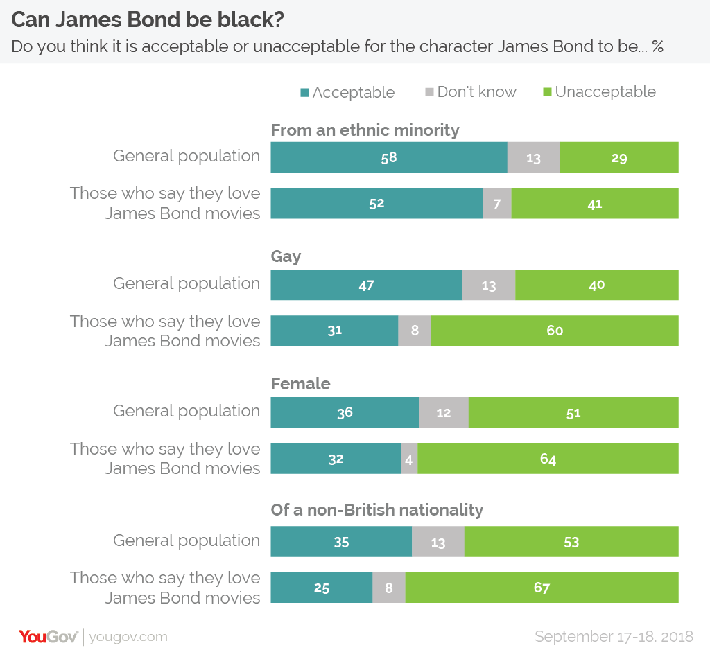

# 2020/W5: Brexit Bond

**Data (data.world):** [https://data.world/makeovermonday/2020w5-brexit-bond](https://data.world/makeovermonday/2020w5-brexit-bond)

**Article / original viz:** [https://yougov.co.uk/topics/entertainment/articles-reports/2018/10/02/idris-elba-publics-favourite-next-james-bond](https://yougov.co.uk/topics/entertainment/articles-reports/2018/10/02/idris-elba-publics-favourite-next-james-bond)

**Dataset:** `makeovermonday/2020w5-brexit-bond`  
**Last updated on data.world:** 2020-02-02T13:13:31.715Z

---

Brexit Bond

---
{"editor":"markdown"}
---
# **Original Visualization**

\# \*\*About this Dataset\*\*
SOURCE ARTICLE: [Majority support a black James Bond, but few want a female or gay 007](https://yougov.co.uk/topics/entertainment/articles-reports/2018/10/02/idris-elba-publics-favourite-next-james-bond) 
DATA SOURCE: [YouGov](https://d25d2506sfb94s.cloudfront.net/cumulus_uploads/document/sur4dbksy5/Bond_180925_ResultsWithCode.pdf) 

\# \*\*Objectives\*\*

* What works and what doesn't work with this chart?
* How can you make it better?
* THIS DATA DOES NOT MATCH THE ARTICLE BUT IS AN OPPORTUNITY TO BE TOPICAL AND FOCUS ON SOME OF THE APPARENT DIVERSITY IN OPINION BETWEEN BOTH SIDES OF THE BREXIT VOTE