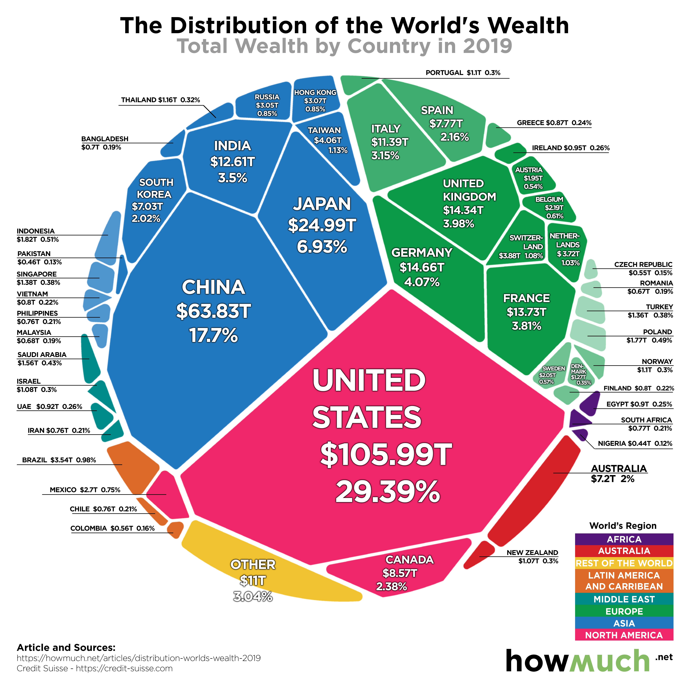

# 2020/W7: World Wealth

**Data (data.world):** [https://data.world/makeovermonday/2020w7-world-wealth](https://data.world/makeovermonday/2020w7-world-wealth)

**Article / original viz:** [https://howmuch.net/articles/distribution-worlds-wealth-2019](https://howmuch.net/articles/distribution-worlds-wealth-2019)

**Dataset:** `makeovermonday/2020w7-world-wealth`  
**Last updated on data.world:** 2020-02-16T10:39:25.847Z

---

World Wealth

---
{"editor":"markdown"}
---
**Original Visualization**

**About this Dataset**

SOURCE ARTICLE: [All the World’s Wealth in One Visual](https://howmuch.net/articles/distribution-worlds-wealth-2019)
DATA SOURCE: [Credit Suisse](https://www.credit-suisse.com/about-us/en/reports-research/global-wealth-report.html)

**Objectives**

* What works and what doesn't work with this chart?
* How can you make it better?