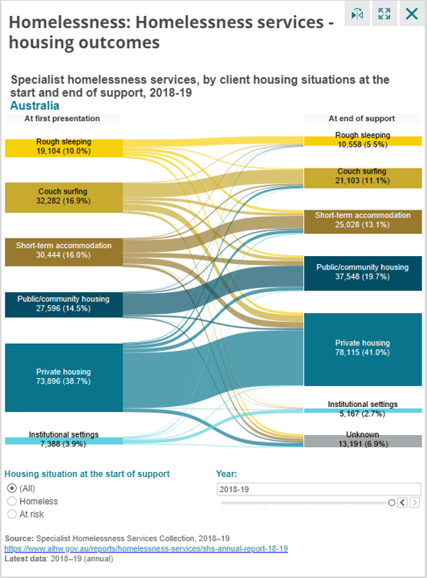

# 2020/W8: Australian Homelessness Services Housing Outcomes

**Data (data.world):** [https://data.world/makeovermonday/2020w8](https://data.world/makeovermonday/2020w8)

**Article / original viz:** [https://www.housingdata.gov.au/dashboard/rex4y12rnpp8rky](https://www.housingdata.gov.au/dashboard/rex4y12rnpp8rky)

**Dataset:** `makeovermonday/2020w8`  
**Last updated on data.world:** 2020-02-23T09:29:10.866Z

---

Housing outcomes for clients of Australian Specialist Homelessness Services

---
{"editor":"markdown"}
---
# **Original Visualization**
)

# **About this Dataset**
SOURCE ARTICLE: [Housing data dashboard](https://www.housingdata.gov.au/dashboard/rex4y12rnpp8rky) (specific view of the Sankey solution; more general view see www.housingdata.gov.au)
DATA SOURCE: [Specialist homelessness services annual report 2017–18](https://www.aihw.gov.au/reports/homelessness-services/specialist-homelessness-services-2017-18/data) (Note that the attached is an adjusted file which has all the years needed to replicate the ‘Australia’ build in the dashboard – the link is to a single financial year of data only)

PLEASE TAG @aihw ON TWITTER
ADDITIONAL INFORMATION: [Clients, services and outcomes](https://www.aihw.gov.au/reports/homelessness-services/specialist-homelessness-services-2017-18/contents/clients-services-and-outcomes)

# **Objectives**

* What works and what doesn't work with this chart? 
* How can you make it better?