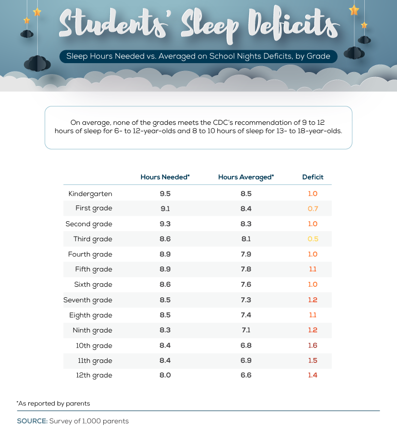

# 2020/W9: Sleep Hours Needed Vs. Averaged

**Data (data.world):** [https://data.world/makeovermonday/2020w9](https://data.world/makeovermonday/2020w9)

**Article / original viz:** [https://savvysleeper.org/costing-kids-sleep/](https://savvysleeper.org/costing-kids-sleep/)

**Dataset:** `makeovermonday/2020w9`  
**Last updated on data.world:** 2020-03-01T08:25:21.837Z

---

Sleep Hours Needed Vs. Averaged

---
{"editor":"simple"}
---
# **Original Visualization**

# **About this Dataset**
SOURCE ARTICLE: [Costing Kids Sleep](https://savvysleeper.org/costing-kids-sleep/)
DATA SOURCE: [Costing Kids Sleep](https://savvysleeper.org/costing-kids-sleep/)

# **Objectives**
\* What works and what doesn't work with this chart?
\* How can you make it better?
\* What can Tableau users do with the new viz transitions feature in version 2020.1?