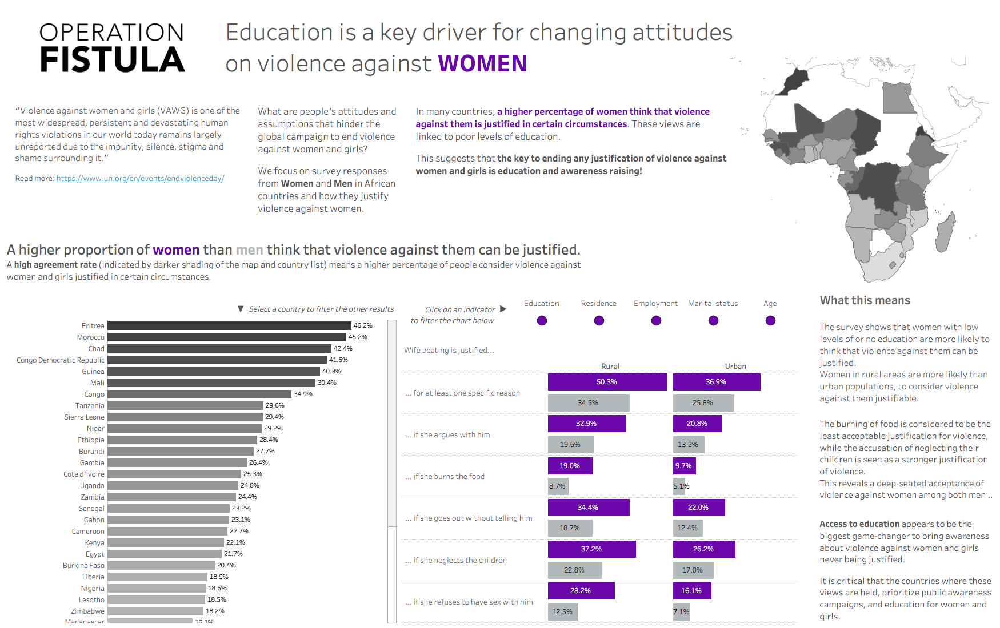

# 2020/W10: #Viz5 - Violence Against Women & Girls

**Data (data.world):** [https://data.world/makeovermonday/2020w10](https://data.world/makeovermonday/2020w10)

**Article / original viz:** [https://public.tableau.com/profile/operation.fistula6589#!/vizhome/Internationaldayfortheeliminationofviolenceagainstwomen/Violenceagainstwomen](https://public.tableau.com/profile/operation.fistula6589#!/vizhome/Internationaldayfortheeliminationofviolenceagainstwomen/Violenceagainstwomen)

**Dataset:** `makeovermonday/2020w10`  
**Last updated on data.world:** 2020-03-08T10:24:10.128Z

---

Violence Against Women & Girls - perceptions in African, Asian and South American countries

---
{"editor":"markdown"}
---
# **Original Visualization**

# **About this Dataset**
ORIGINAL VISUALIZATION: [International day for the elimination of violence against women](https://public.tableau.com/profile/operation.fistula6589#!/vizhome/Internationaldayfortheeliminationofviolenceagainstwomen/Violenceagainstwomen)
BACKGROUND INFORMATION AND DATA DICTIONARY: See PDF files
PLEASE TAG [OPFISTULA](https://twitter.com/opfistula) IN YOUR TWEETS

# **Objectives**

* What works and what doesn't work with this chart? 
* How can you make it better?