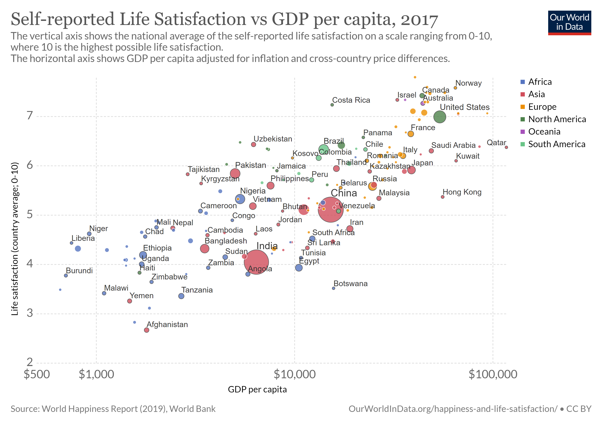

# 2020/W11: Self-reported Life Satisfaction vs GDP per capita

**Data (data.world):** [https://data.world/makeovermonday/2020w11-self-reported-life-satisfaction-vs-gdp-per-capita](https://data.world/makeovermonday/2020w11-self-reported-life-satisfaction-vs-gdp-per-capita)

**Article / original viz:** [https://ourworldindata.org/happiness-and-life-satisfaction](https://ourworldindata.org/happiness-and-life-satisfaction)

**Dataset:** `makeovermonday/2020w11-self-reported-life-satisfaction-vs-gdp-per-capita`  
**Last updated on data.world:** 2020-03-17T07:28:47.474Z

---

---
{"editor":"simple"}
---
# **Original Visualization**

# **About this Dataset**
SOURCE ARTICLE: [Our World in Data](https://ourworldindata.org/happiness-and-life-satisfaction)
DATA SOURCE: [World Bank](https://datacatalog.worldbank.org/dataset/world-development-indicators)

# **Objectives**
* What works and what doesn't work with this chart? 
* How can you make it better?
* I've added three data files. One associated with the original visualisation, one to allow you to assign countries to regions, or a .hyper file for Tableau users which joined the two sources together if you can't figure out how to do it yourselves!