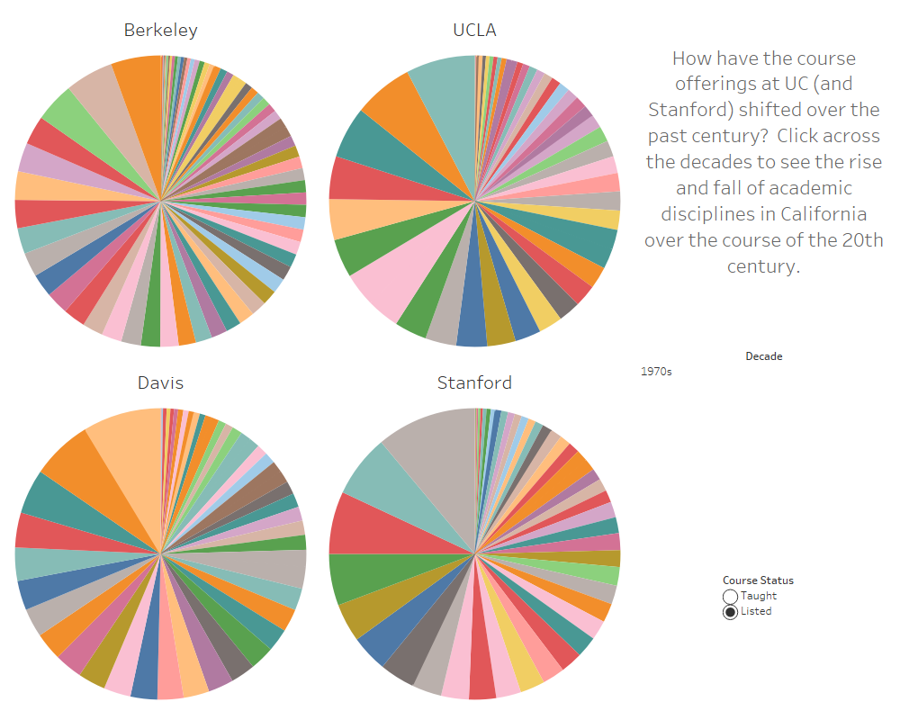

# 2020/W12: Number of Fields of Study at California University

**Data (data.world):** [https://data.world/makeovermonday/2020w12](https://data.world/makeovermonday/2020w12)

**Article / original viz:** [http://uccliometric.org/course-interactive-dashboard/](http://uccliometric.org/course-interactive-dashboard/)

**Dataset:** `makeovermonday/2020w12`  
**Last updated on data.world:** 2020-03-22T08:01:24.601Z

---

---
{"editor":"markdown"}
---
# **Original Visualization**

# **About this Dataset**
SOURCE ARTICLE: [California University History: Number of Distinct Fields of Study by University](http://uccliometric.org/course-interactive-dashboard/)
DATA SOURCE: [US ClioMetrics History Project](https://berkeley.app.box.com/v/CoursesBerkeley)

# **Objectives**

* What works and what doesn't work with this chart? 
* How can you make it better?