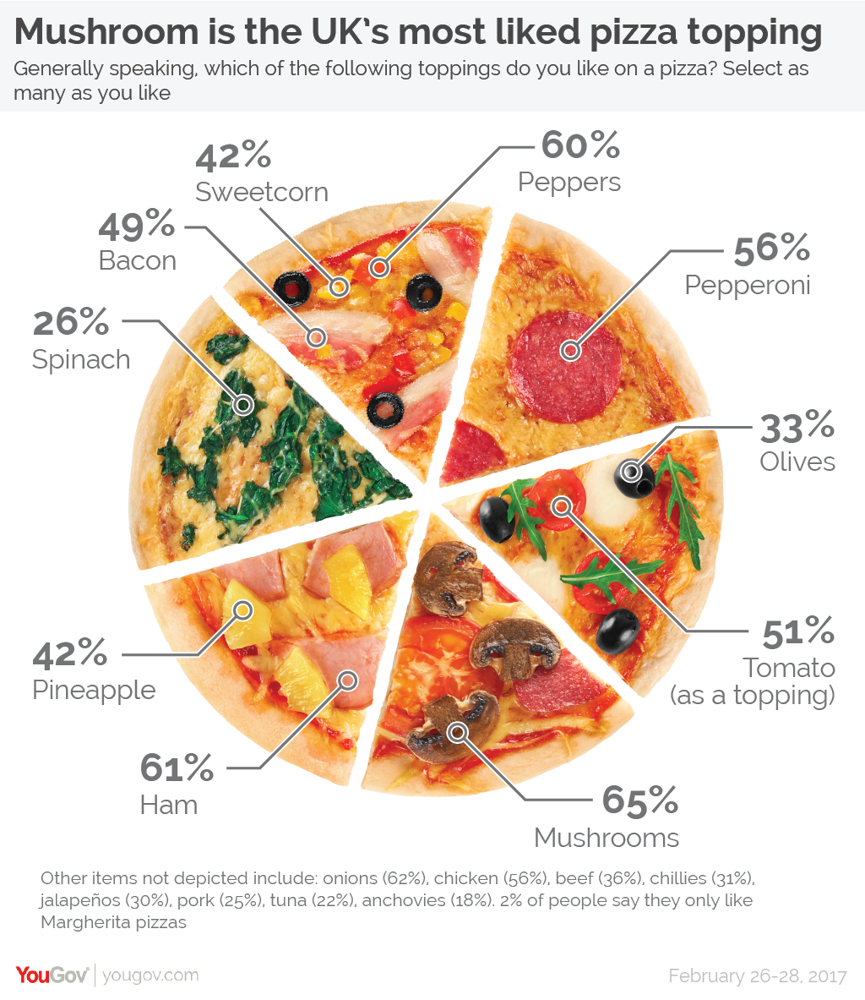

# 2020/W13 Does pineapple belong on a pizza?

**Data (data.world):** [https://data.world/makeovermonday/2020w13-does-pineapple-belong-on-a-pizza](https://data.world/makeovermonday/2020w13-does-pineapple-belong-on-a-pizza)

**Article / original viz:** [https://yougov.co.uk/topics/politics/articles-reports/2017/03/06/does-pineapple-belong-pizza](https://yougov.co.uk/topics/politics/articles-reports/2017/03/06/does-pineapple-belong-pizza)

**Dataset:** `makeovermonday/2020w13-does-pineapple-belong-on-a-pizza`  
**Last updated on data.world:** 2020-03-29T07:43:27.738Z

---

Does pineapple belong on a pizza?

---
{"editor":"simple"}
---
# **Original Visualization**

# **About this Dataset**
SOURCE ARTICLE: [YouGov](https://yougov.co.uk/topics/politics/articles-reports/2017/03/06/does-pineapple-belong-pizza)
DATA SOURCE: [YouGov](https://d25d2506sfb94s.cloudfront.net/cumulus_uploads/document/7ordz029w2/InternalResults_170228_Pizza_W.pdf)

# **Objectives**
* What works and what doesn't work with this chart? 
* How can you make it better?
* What is your favourite pizza topping?