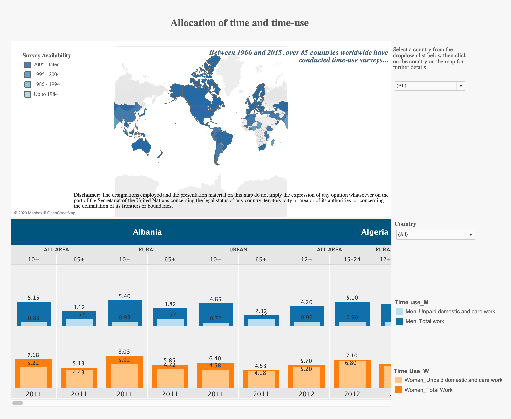

# 2020/W14: Unpaid Work - Allocation of time and time-use

**Data (data.world):** [https://data.world/makeovermonday/2020w14](https://data.world/makeovermonday/2020w14)

**Article / original viz:** [https://unstats.un.org/unsd/gender/timeuse/index.html](https://unstats.un.org/unsd/gender/timeuse/index.html)

**Dataset:** `makeovermonday/2020w14`  
**Last updated on data.world:** 2020-04-05T12:31:33.535Z

---

Unpaid Work - Allocation of time and time-use

---
{"editor":"markdown"}
---
# **Original Visualization**

# **About this Dataset**
SOURCE ARTICLE: [Unpaid work: Allocation of time and time-use](https://unstats.un.org/unsd/gender/timeuse/index.html)
DATA SOURCE: [UN Stats](https://unstats.un.org/unsd/gender/timeuse/index.html)

# **Objectives**

* What works and what doesn't work with this chart? 
* How can you make it better?