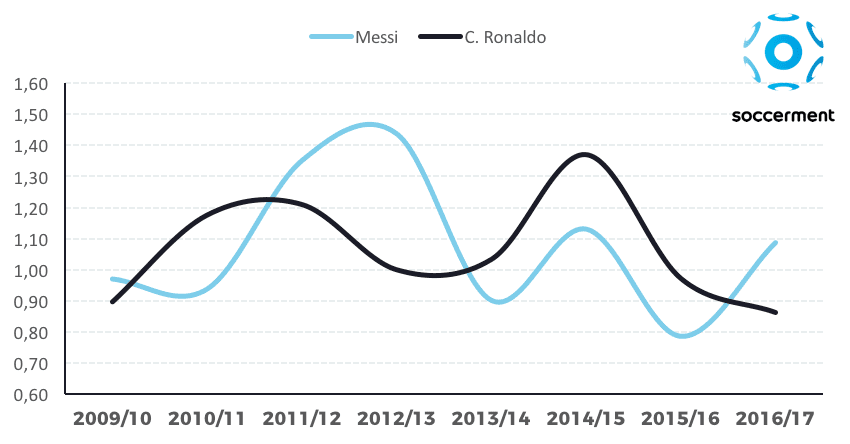

# 2020/W15: Messi Vs Ronaldo Stats

**Data (data.world):** [https://data.world/makeovermonday/2020w15-messi-vs-ronaldo-stats](https://data.world/makeovermonday/2020w15-messi-vs-ronaldo-stats)

**Article / original viz:** [https://soccerment.com/2018-topscorer-preview-spanish-la-liga/](https://soccerment.com/2018-topscorer-preview-spanish-la-liga/)

**Dataset:** `makeovermonday/2020w15-messi-vs-ronaldo-stats`  
**Last updated on data.world:** 2020-04-12T09:27:04.059Z

---

Messi Vs Ronaldo Stats

---
{"editor":"markdown"}
---
# **Original Visualization**
 

# **About this Dataset**
SOURCE ARTICLE: [Soccerment](https://soccerment.com/2018-topscorer-preview-spanish-la-liga/) 
DATA SOURCE: [www.transfermarkt.com](http://www.transfermarkt.com) 

# **Objectives**
\* What works and what doesn't work with this chart? 
\* How can you make it better?
\* I've provided more data than you need to replicate the original chart. What additional insights can you uncover and present to give a more thorough analysis of these two players?