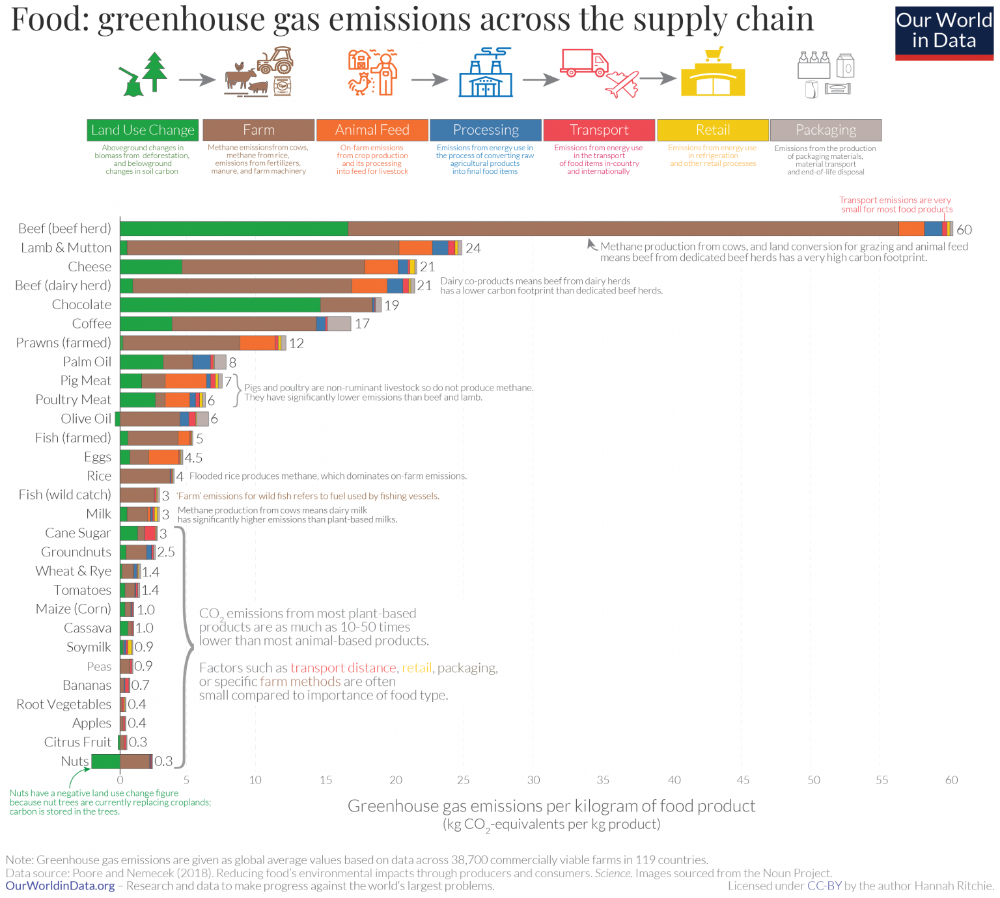

# 2020/W16: Food: Greenhouse Gas Emission across supply chain

**Data (data.world):** [https://data.world/makeovermonday/2020w16](https://data.world/makeovermonday/2020w16)

**Article / original viz:** [https://ourworldindata.org/food-choice-vs-eating-local](https://ourworldindata.org/food-choice-vs-eating-local)

**Dataset:** `makeovermonday/2020w16`  
**Last updated on data.world:** 2020-04-25T09:06:55.876Z

---

Food: Greenhouse Gas Emission across supply chain

---
{"editor":"markdown"}
---
# **Original Visualization**

# **About this Dataset**
SOURCE ARTICLE: [Focus on what you eat, not whether your food is local](https://ourworldindata.org/food-choice-vs-eating-local)
DATA SOURCE: [GHG emissions by Lifecycle stage](https://ourworldindata.org/uploads/2020/02/GHG-emissions-by-life-cycle-stage-OurWorldinData-upload.csv)

# **Objectives**

* What works and what doesn't work with this chart? 
* How can you make it better?