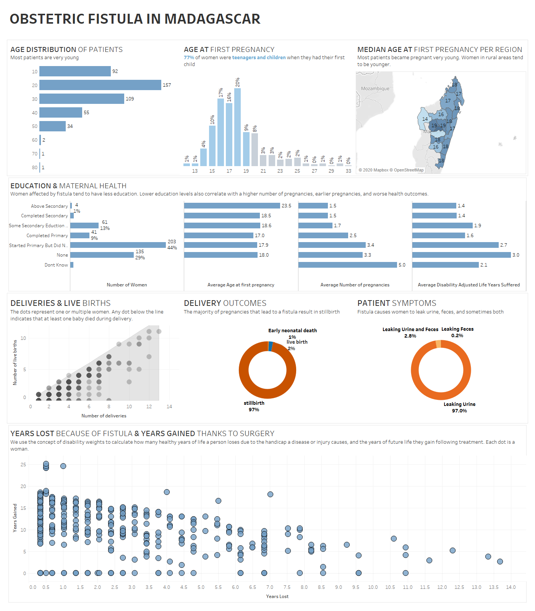

# 2020/W18: Viz 5 - Obstetric Fistula in Madagascar

**Data (data.world):** [https://data.world/makeovermonday/2020w18](https://data.world/makeovermonday/2020w18)

**Article / original viz:** [https://data.world/makeovermonday/2020w18/file/Visualize%20Gender%20Equality%20Dataset%20%233.pdf](https://data.world/makeovermonday/2020w18/file/Visualize%20Gender%20Equality%20Dataset%20%233.pdf)

**Dataset:** `makeovermonday/2020w18`  
**Last updated on data.world:** 2020-05-03T09:47:31.172Z

---

Viz 5 - Obstetric Fistula in Madagascar

---
{"editor":"markdown"}
---
# **Original Visualization**

# **About this Dataset**
PLEASE REFER TO THE PDF ATTACHMENTS BELOW (DESCRIPTION AND DATA DICTIONARY)
Please tag #Viz5 and @opfistula on Twitter

# **Objectives**

* What works and what doesn't work with this chart? 
* How can you make it better?