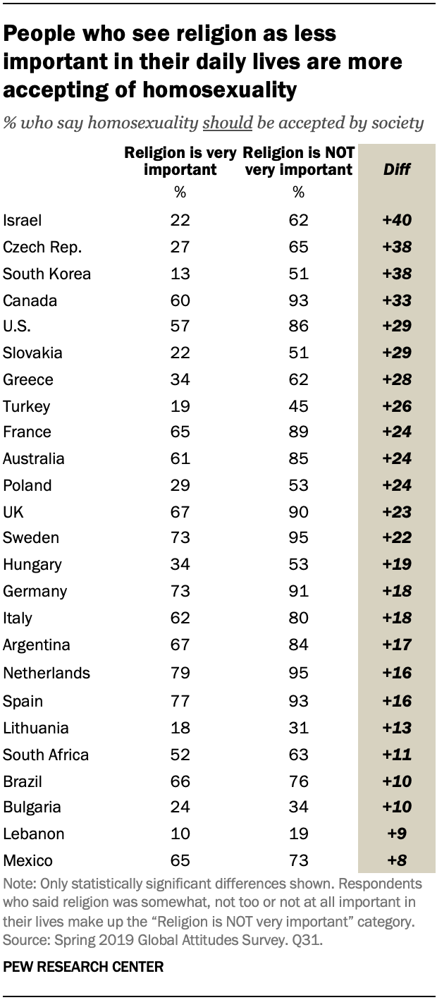

# 2020/W29: The Global Divide on Homosexuality Persists

**Data (data.world):** [https://data.world/makeovermonday/2020w29-the-global-divide-on-homosexuality-persists](https://data.world/makeovermonday/2020w29-the-global-divide-on-homosexuality-persists)

**Article / original viz:** [https://www.pewresearch.org/global/2020/06/25/global-divide-on-homosexuality-persists/](https://www.pewresearch.org/global/2020/06/25/global-divide-on-homosexuality-persists/)

**Dataset:** `makeovermonday/2020w29-the-global-divide-on-homosexuality-persists`  
**Last updated on data.world:** 2020-07-18T20:52:31.442Z

---

---
{"editor":"simple"}
---
# **Original Visualization**

# **About this Dataset**
SOURCE ARTICLE: [Pew Research](https://www.pewresearch.org/global/2020/06/25/global-divide-on-homosexuality-persists)
DATA SOURCE: [The Global Divide on Homosexuality Persists](https://www.pewresearch.org/global/2020/06/25/global-divide-on-homosexuality-persists)

# **Objectives**
\* What works and what doesn't work with this chart?
\* How can you make it better?