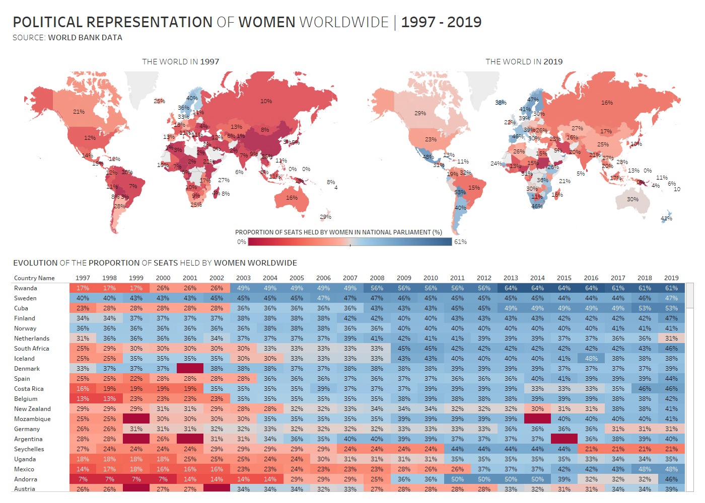

# 2020/W30: Women in Power

**Data (data.world):** [https://data.world/makeovermonday/2020w30](https://data.world/makeovermonday/2020w30)

**Article / original viz:** [https://data.worldbank.org/indicator/SG.GEN.PARL.ZS](https://data.worldbank.org/indicator/SG.GEN.PARL.ZS)

**Dataset:** `makeovermonday/2020w30`  
**Last updated on data.world:** 2020-07-25T21:19:11.199Z

---

Women in Power - gender inequality in the context of political appointments and parliamentary representation

---
{"editor":"markdown"}
---
# **Original Visualization**

Visualization provided by OperationFistula.org

# **About this Dataset**
SOURCE ARTICLE: [Proportion of seats held by women in national parliaments](https://data.worldbank.org/indicator/SG.GEN.PARL.ZS)
DATA SOURCE: [World Bank](http://api.worldbank.org/v2/en/indicator/SG.GEN.PARL.ZS?downloadformat=excel)

# **Objectives**

* What works and what doesn't work with this chart? 
* How can you make it better?