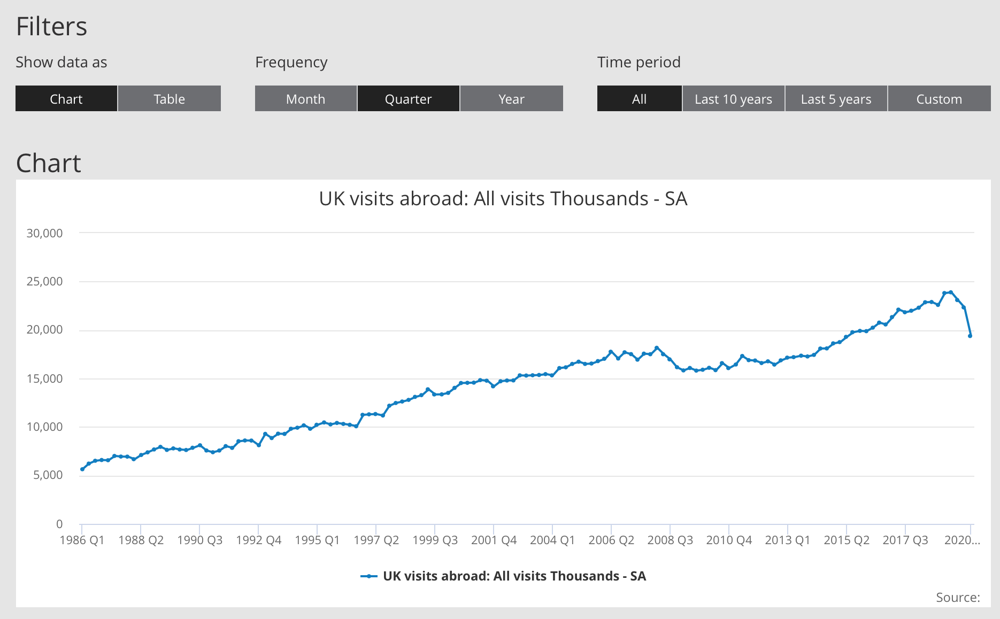

# 2020/W31: UK visits abroad

**Data (data.world):** [https://data.world/makeovermonday/2020w31-uk-visits-abroad](https://data.world/makeovermonday/2020w31-uk-visits-abroad)

**Article / original viz:** [https://www.ons.gov.uk/peoplepopulationandcommunity/leisureandtourism/timeseries/gmax/ott](https://www.ons.gov.uk/peoplepopulationandcommunity/leisureandtourism/timeseries/gmax/ott)

**Dataset:** `makeovermonday/2020w31-uk-visits-abroad`  
**Last updated on data.world:** 2020-08-02T13:56:25.371Z

---

---
{"editor":"markdown"}
---
# **Original Visualization**

# **About this Dataset**
SOURCE ARTICLE: [UK visits abroad: All visits Thousands - SA](https://www.ons.gov.uk/peoplepopulationandcommunity/leisureandtourism/timeseries/gmax/ott)
DATA SOURCE: [ONS](https://www.ons.gov.uk/peoplepopulationandcommunity/leisureandtourism/timeseries/gmax/ott)

# **Objectives**

* What works and what doesn't work with this chart?
* How can you make it better?
* We ALL know the reason why visits have dropped in the current climate, but don't focus on that - what patterns can you find beyond the overall upward trend?