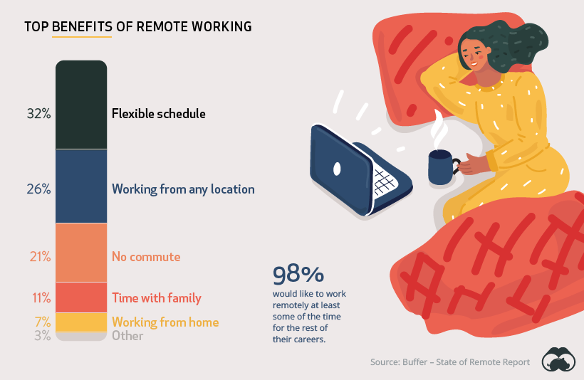

# 2020/W32: Benefits of Remote Work

**Data (data.world):** [https://data.world/makeovermonday/2020w32](https://data.world/makeovermonday/2020w32)

**Article / original viz:** [https://www.visualcapitalist.com/how-people-and-companies-feel-about-working-remotely/](https://www.visualcapitalist.com/how-people-and-companies-feel-about-working-remotely/)

**Dataset:** `makeovermonday/2020w32`  
**Last updated on data.world:** 2020-08-09T12:15:14.034Z

---

Benefits of Remote Work

---
{"editor":"markdown"}
---
# **Original Visualization**

# **About this Dataset**
SOURCE ARTICLE: [How People and Companies Feel About Working Remotely](https://www.visualcapitalist.com/how-people-and-companies-feel-about-working-remotely/)
DATA SOURCE: [State of Remote Work 2020](https://lp.buffer.com/state-of-remote-work-2020)

# **Objectives**

* What works and what doesn't work with this chart? 
* How can you make it better?