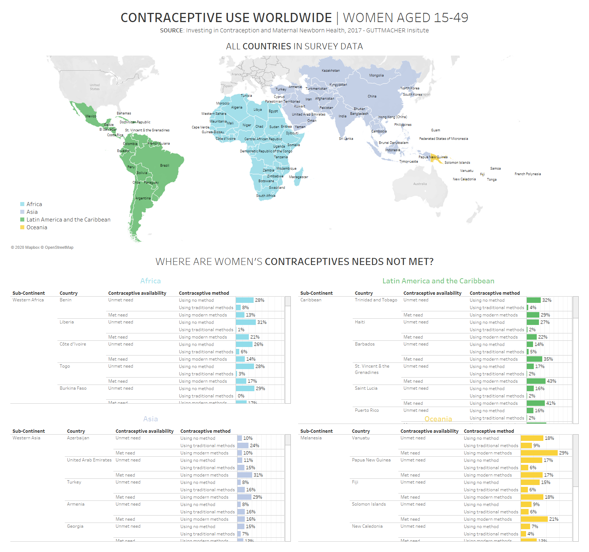

# 2020/W34: Sexual and Reproductive Health and Rights (SRHR)

**Data (data.world):** [https://data.world/makeovermonday/2020w34](https://data.world/makeovermonday/2020w34)

**Article / original viz:** [https://media.data.world/boFwVig9ToOkffjnzVMC_Main%20Dashboard.png](https://media.data.world/boFwVig9ToOkffjnzVMC_Main%20Dashboard.png)

**Dataset:** `makeovermonday/2020w34`  
**Last updated on data.world:** 2020-08-22T05:31:53.283Z

---

Sexual and Reproductive Health and Rights (SRHR)

---
{"editor":"markdown"}
---
# **Original Visualization**

# **About this Dataset**
SOURCE ARTICLE: **Dashboard and documentation provided by OpFistula** - please see attachments (CSV, PDF) below
DATA SOURCE: [Guttmacher Institute’s report: Adding It Up: Investing in
Contraception and Maternal and Newborn Health, 2017](https://www.guttmacher.org/sites/default/files/report_pdf/adding-it-up-2017-estimation-methodology.pdf)

# **Objectives**

* What works and what doesn't work with this chart? 
* How can you make it better? 

**Please include #Viz5 and tag @OpFistula in your tweets**