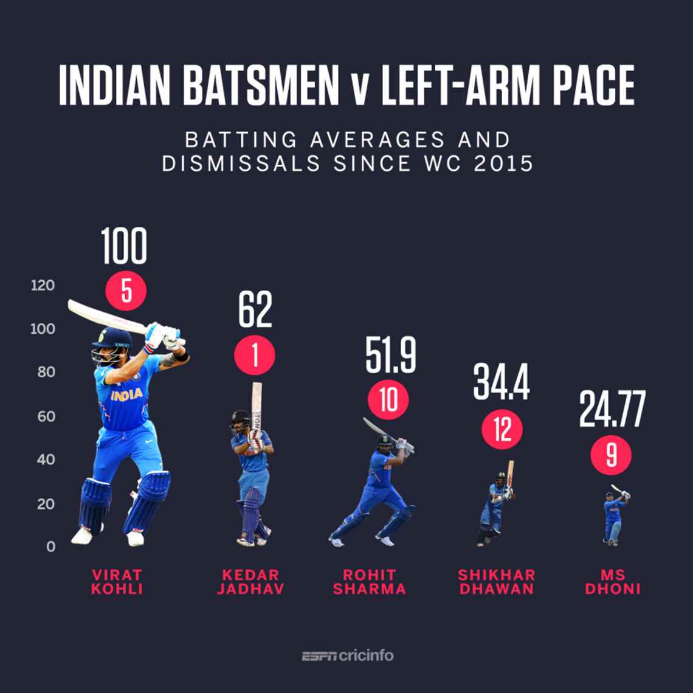

# 2020/W35: Indian batsmen v left-arm pace

**Data (data.world):** [https://data.world/makeovermonday/2020w35-indian-batsmen-v-left-arm-pace](https://data.world/makeovermonday/2020w35-indian-batsmen-v-left-arm-pace)

**Article / original viz:** [https://www.espncricinfo.com/story/_/id/26927142/how-india-beat-australia](https://www.espncricinfo.com/story/_/id/26927142/how-india-beat-australia)

**Dataset:** `makeovermonday/2020w35-indian-batsmen-v-left-arm-pace`  
**Last updated on data.world:** 2020-08-30T12:29:17.759Z

---

Indian batsmen v left-arm pace

---
{"editor":"simple"}
---
# **Original Visualization**

# **About this Dataset**
SOURCE ARTICLE: [Tactics Board: How India can beat Australia](https://www.espncricinfo.com/story/_/id/26927142/how-india-beat-australia)
DATA SOURCE: [ESPNcricinfo.com](https://www.espncricinfo.com/story/_/id/26927142/how-india-beat-australia)

# **Objectives**
\* What works and what doesn't work with this chart?
\* How can you make it better?