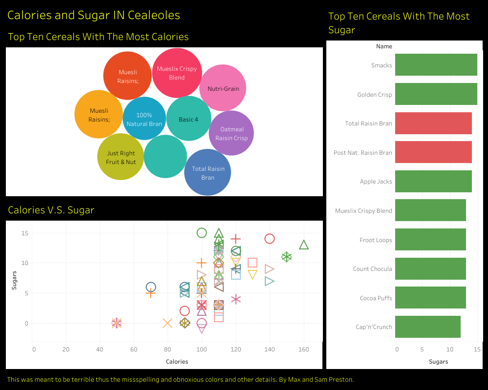

# 2020/W36: Calories and Sugar in Cereals

**Data (data.world):** [https://data.world/makeovermonday/2020w36](https://data.world/makeovermonday/2020w36)

**Article / original viz:** [https://www.healthline.com/nutrition/are-breakfast-cereals-healthy](https://www.healthline.com/nutrition/are-breakfast-cereals-healthy)

**Dataset:** `makeovermonday/2020w36`  
**Last updated on data.world:** 2020-09-06T10:26:37.621Z

---

Calories and sugar in 80 different cereals

---
{"editor":"markdown"}
---
# **Original Visualization**

PLEASE NOTE: Max and Sam Preston have created this viz and deliberately gone against all best practices that they have learned. Please take a moment to check out the original, consider what improvements it needs, read the article below and then create your own Makeover.

# **About this Dataset**
SOURCE ARTICLE: [Breakfast Cereals: Healthy or Unhealthy?](https://www.healthline.com/nutrition/are-breakfast-cereals-healthy)
DATA SOURCE: [Kaggle](https://www.kaggle.com/crawford/80-cereals?select=cereal.csv)

# **Objectives**
* What works and what doesn't work with this chart? 
* How can you make it better?