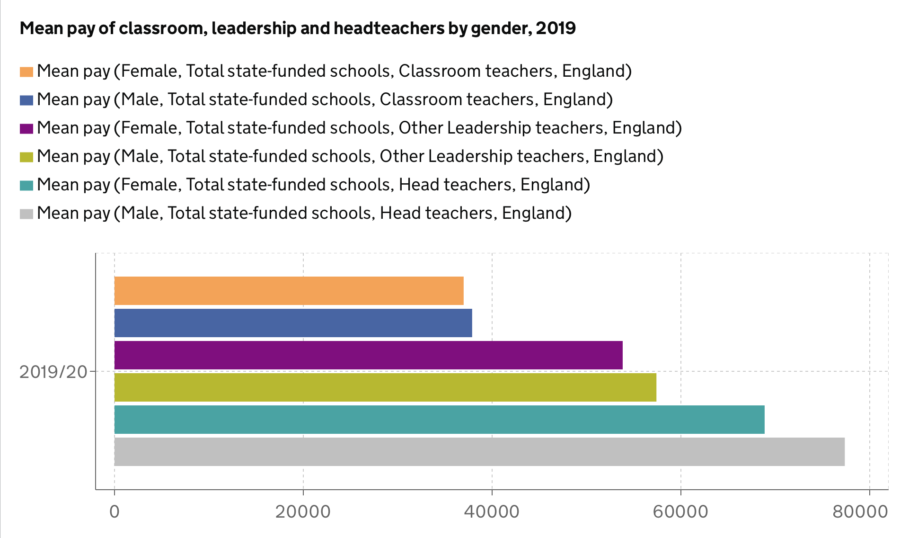

# 2020/W37: School workforce in England

**Data (data.world):** [https://data.world/makeovermonday/2020w37-school-workforce-in-england](https://data.world/makeovermonday/2020w37-school-workforce-in-england)

**Article / original viz:** [https://explore-education-statistics.service.gov.uk/find-statistics/school-workforce-in-england#releaseHeadlines-charts](https://explore-education-statistics.service.gov.uk/find-statistics/school-workforce-in-england#releaseHeadlines-charts)

**Dataset:** `makeovermonday/2020w37-school-workforce-in-england`  
**Last updated on data.world:** 2020-09-13T16:56:25.985Z

---

---
{"editor":"markdown"}
---
# **Original Visualization**

# **About this Dataset**
SOURCE ARTICLE: [School workforce in England, Reporting Year 2019](https://explore-education-statistics.service.gov.uk/find-statistics/school-workforce-in-england#releaseHeadlines-charts)
DATA SOURCE: [School Workforce Census](https://explore-education-statistics.service.gov.uk/find-statistics/school-workforce-in-england#releaseHeadlines-charts)

# **Objectives**
\* What works and what doesn't work with this chart?
\* How can you make it better?