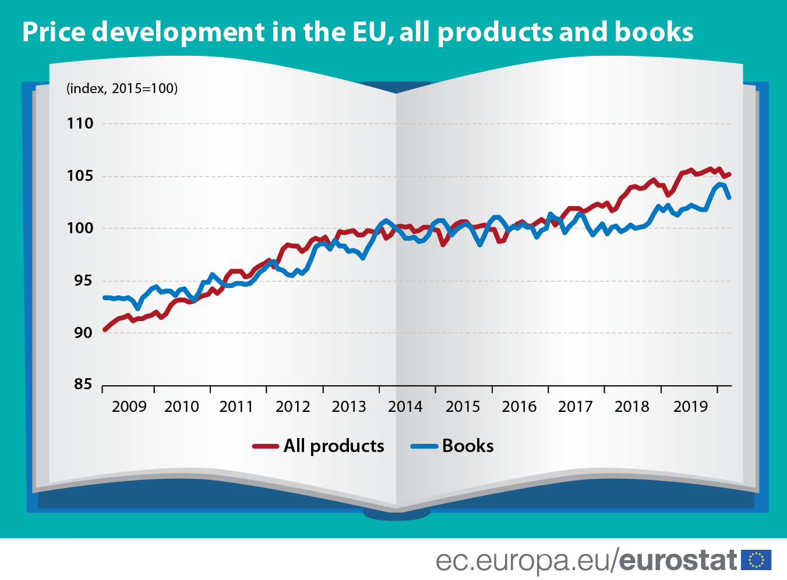

# 2020/w38: Pick up a book and read!

**Data (data.world):** [https://data.world/makeovermonday/2020w38](https://data.world/makeovermonday/2020w38)

**Article / original viz:** [https://ec.europa.eu/eurostat/en/web/products-eurostat-news/-/EDN-20200422-1](https://ec.europa.eu/eurostat/en/web/products-eurostat-news/-/EDN-20200422-1)

**Dataset:** `makeovermonday/2020w38`  
**Last updated on data.world:** 2020-09-20T09:00:51.434Z

---

---
{"editor":"markdown"}
---
# **Original Visualization**

# **About this Dataset**
SOURCE ARTICLE: [Pick up a book and read!](https://ec.europa.eu/eurostat/en/web/products-eurostat-news/-/EDN-20200422-1)
DATA SOURCE: [Eurostat](https://appsso.eurostat.ec.europa.eu/nui/show.do?query=BOOKMARK_DS-055106_QID_2BA8FB1D_UID_-3F171EB0&layout=TIME,C,X,0;COICOP,B,Y,0;UNIT,B,Z,0;GEO,B,Z,1;INDICATORS,C,Z,2;&zSelection=DS-055106INDICATORS,OBS_FLAG;DS-055106GEO,EU27_2020;DS-055106UNIT,I15;&rankName1=UNIT_1_2_-1_2&rankName2=INDICATORS_1_2_-1_2&rankName3=GEO_1_2_1_1&rankName4=TIME_1_0_0_0&rankName5=COICOP_1_2_0_1&sortC=ASC_-1_FIRST&rStp=&cStp=&rDCh=&cDCh=&rDM=true&cDM=true&footnes=false&empty=false&wai=false&time_mode=NONE&time_most_recent=false&lang=EN&cfo=%23%23%23%2C%23%23%23.%23%23%23)

# **Objectives**

* What works and what doesn't work with this chart?
* How can you make it better?