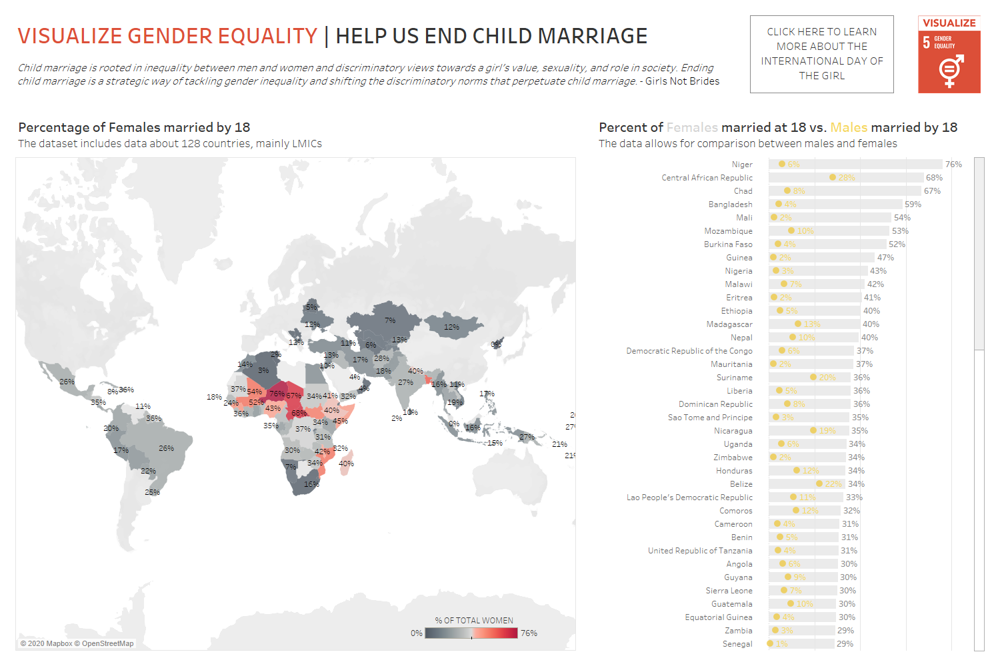

# 2020/W39:  #Viz5 Child Marriage

**Data (data.world):** [https://data.world/makeovermonday/2020w39](https://data.world/makeovermonday/2020w39)

**Article / original viz:** [https://data.unicef.org/topic/child-protection/child-marriage/](https://data.unicef.org/topic/child-protection/child-marriage/)

**Dataset:** `makeovermonday/2020w39`  
**Last updated on data.world:** 2020-10-01T14:55:10.282Z

---

---
{"editor":"markdown"}
---
# **Original Visualization**

# **About this Dataset**
Child marriage is rooted in inequality between men and women and discriminatory views towards a girl’s value, sexuality, and role in society. Ending child marriage is a strategic way of tackling gender inequality and shifting the discriminatory norms that perpetuate child marriage.
This week's Viz5 challenge aims to highlight the impact of child marriage.

DATA SOURCE: [UNICEF global databases, 2020](https://data.unicef.org/topic/child-protection/child-marriage/)

# **Objectives**

* What works and what doesn't work with this chart? 
* How can you make it better?